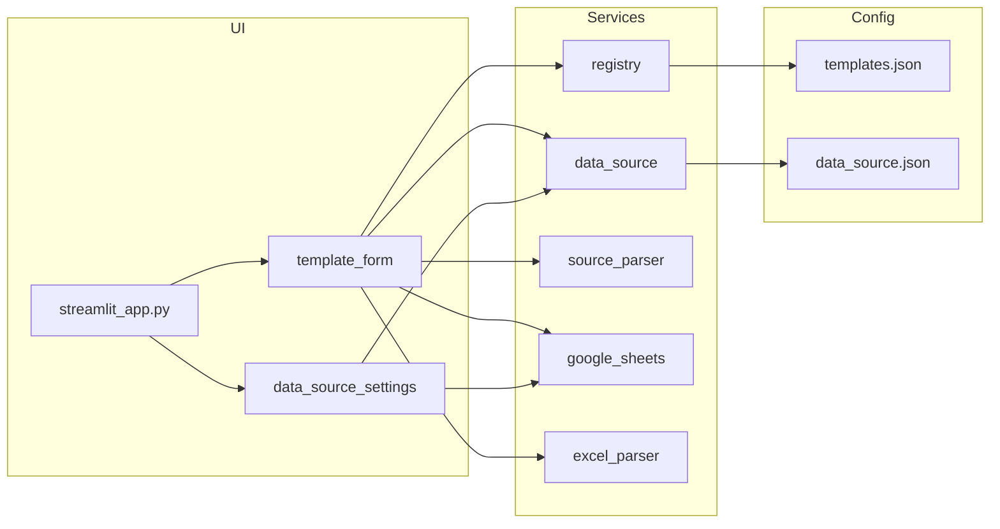

# Excel Template Viz — 项目概览（CodeGraph 风格快照）

> 快照日期：**2026-06-08** · 工作区：`e:\my_github\excel-template-viz`

本文档按 [CodeGraph 约定](https://github.com/) 手工整理（当前工作区未启用 CodeGraph MCP，故为静态快照）。重大重构后可请求 Agent 执行 `codegraph_reindex_workspace` 与 `codegraph_generate_architecture_doc` 刷新。

---

## 项目定位

Streamlit 应用：将 Excel 模板（如 GIN LOT List）可视化为 Web 表单，支持制表符粘贴批量填表、Google Sheet 默认数据源按 PO 查询填表，并导出更新后的 xlsx。

---

## 目录与模块

| 路径 | 职责 |
|------|------|
| `streamlit_app.py` | **应用入口**（须在项目根目录 `streamlit run`） |
| `app/main.py` | 侧边栏导航、数据源区、模板页路由 |
| `app/components/template_form.py` | 单模板表单：PO 查询、源数据粘贴、下载 |
| `app/components/data_source_settings.py` | 侧边栏「添加数据源」：认证、测试、保存配置 |
| `app/services/registry.py` | 从 `config/templates.json` 加载模板元数据 |
| `app/services/data_source.py` | `config/data_source.json` 读写 |
| `app/services/excel_parser.py` | xlsx 读写、Spreadsheet ID 解析 |
| `app/services/source_parser.py` | 制表符行 / Sheet 行 → 表单字段映射 |
| `app/services/google_sheets.py` | gspread 连接、预览、按 ID 查行 |
| `app/services/shutdown.py` | 后台 PID、优雅关闭 |
| `config/templates.json` | 模板注册表 |
| `config/data_source.json` | 默认 Google Sheet（运行时生成） |
| `templates/` | 本地 xlsx 模板文件 |
| `credentials/` | OAuth 客户端 JSON（不入库） |
| `tests/` | pytest 单元测试 |

---

## 入口点

| 类型 | 位置 | 说明 |
|------|------|------|
| Streamlit main | `streamlit_app.py` → `app.main.main` | `run.bat` 与手动启动均使用此路径 |
| CLI 测试 | `pytest` | `pyproject.toml` 中 `pythonpath = ["."]` |

**导入修复要点：** 不可再执行 `streamlit run app/app.py`。脚本位于 `app/` 内时 Python 将 `app` 解析为 `app.py` 模块而非包，导致 `from app.components...` 失败。

---

## 数据流

1. **制表符粘贴：** 用户粘贴 Tab 分隔行 → `parse_source_text` → `merge_parsed_into_headers` → 表单。
2. **PO 查询：** 已保存 `data_source.json` + 会话内 Google 凭证 → `fetch_row_by_id` → `sheet_row_to_form_fields` → 表单。
3. **导出：** 表单行 → `write_template_sheet` → 下载 xlsx。

---

## Google Sheet 列映射（GIN LOT）

| Sheet 列 | 表单字段 |
|----------|----------|
| PO（可配置 ID 列名） | P.O. No. |
| Container# | Container No. |
| recv. date | YY / MM / DD / Receiving Date |

手动填写：`Container Seal No.`、`Lot No.`

---

## 全局统计（估算）

| 指标 | 数值 |
|------|------|
| Python 源文件 | ~15 |
| 测试文件 | 5 |
| 外部依赖 | streamlit, pandas, openpyxl, gspread, google-auth |

---

## 维护建议

1. 新模板：编辑 `config/templates.json`，无需改入口代码。
2. 改 Sheet 列映射：优先改 `app/services/source_parser.py` 中常量与 `sheet_row_to_form_fields`。
3. 启用 CodeGraph MCP 后，可对 Agent 说：「对 excel-template-viz 执行 `codegraph_generate_architecture_doc` 并更新本文档。」
