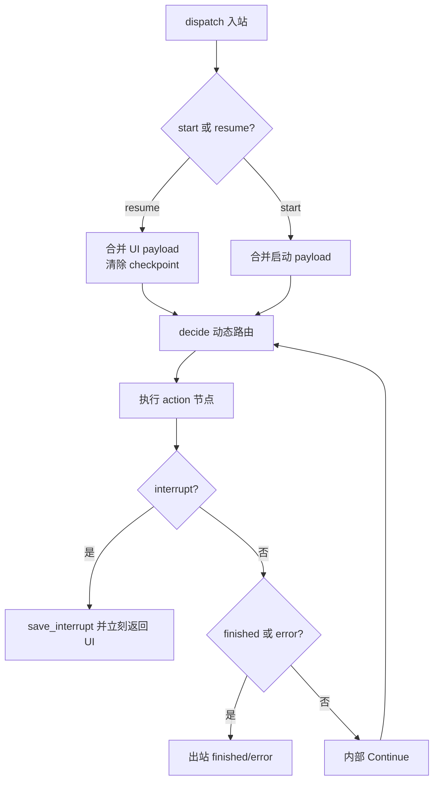
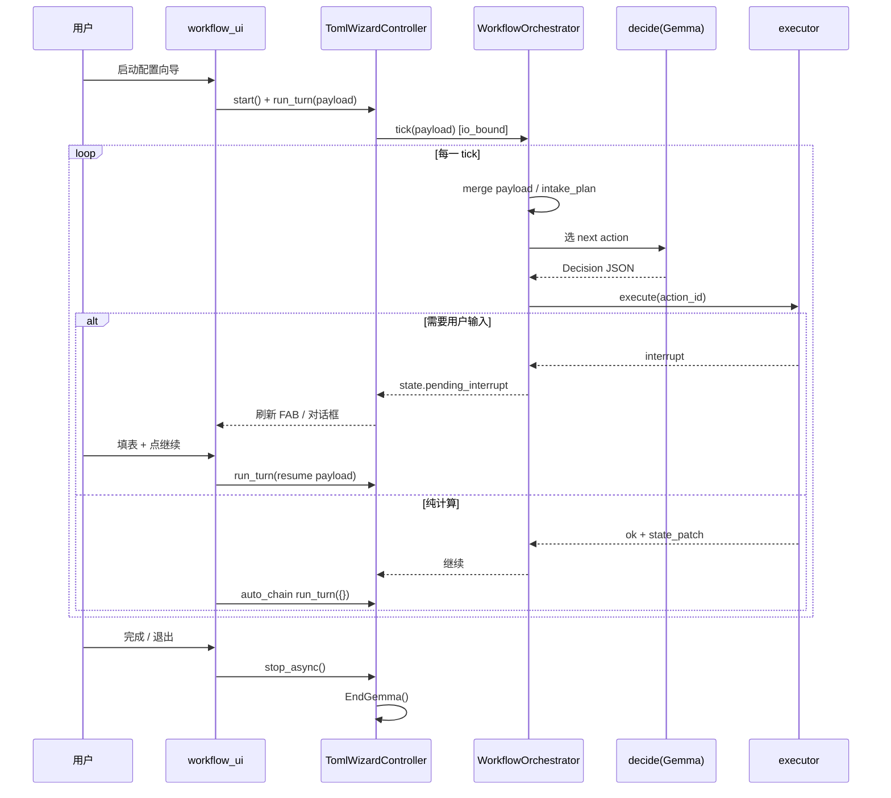

# Gemma4 Dynamic TOML Workflow

> Status: **v1.1** (Graph event dispatch — replaces UI-polled `tick()` auto-chain)  
> Date: 2026-08-16  
> Platform: [`embed_gemma4.md`](embed_gemma4.md) (`open_session` / `generate` / `StartGemma`)  
> Business: [`toml_config_design.md`](toml_config_design.md), [`connect_google.md`](connect_google.md), [`db_store.md`](db_store.md), `app/core_toml.py`, `app/core_split.py`

**Authority**: This document is the source of truth for the TOML configuration workflow. The former fixed 8-step FSM spec (`gemma4_e4b_workflow.md`) has been removed.

---

## 1. Overview

The workflow is **Graph event driven** (start / resume / stop), not a hard-coded stepper and not a UI-polled `tick()` loop:

```
NiceGUI FAB / dialog
    → TomlWizardController.dispatch(Start | Resume | Stop)
    → WorkflowGraph / CompiledWorkflow.dispatch
        → decide()            # dynamic router (thinking=False)
        → execute(action node)
        → Continue (internal, cap 24) OR Interrupt / Finished / Error
    → persist_wizard_toml (progressive + finalize)
```

UI emits only inbound events. Compute auto-chain lives **inside the graph**, not `_auto_chain_ticks`.

**Packages:**

| Path | Role |
|------|------|
| `llm_gemma4/workflow/` | `WorkflowEvent`, `WorkflowGraph`, `CompiledWorkflow`, `MemoryCheckpoint`, sequential map |
| `llm_gemma4/toml_config/` | Domain: `decide`, `executor`, `intake_plan`, `field_agent`, `toml_patcher`, `workflow_orchestrator` |
| `llm_gemma4/runtime/gemma_worker.py` | Single LiteRT worker thread; `await_gemma_thread` |
| `nicegui_ui/components/workflow_ui.py` | Interrupt dialogs, **bottom-left** FAB, sidebar log (no intake checklist) |
| `nicegui_ui/components/toml_wizard.py` | `TomlWizardController` — orchestrator lifecycle, `dispatch` on gemma worker |

There is **no** `llm_gemma4/wizard/` package. No `langgraph` dependency. Field match uses `map_run_sequential` (LiteRT cannot infer across threads).

---

## 2. Graph dispatch loop

Inbound events: `start` | `resume` | `stop`  
Outbound events: `interrupt` | `finished` | `error`  
Internal only: `continue` (cap 24)

`WorkflowOrchestrator.dispatch(event)` → `CompiledWorkflow.dispatch`:

1. `resume` (or start while checkpoint pending) → merge `payload`, clear interrupt
2. Each cycle: `decide()` (router) → one action node → patch / history
3. Node `interrupt` → `MemoryCheckpoint.save_interrupt`, **return immediately** (one interrupt per dispatch)
4. Compute success → internal Continue
5. `is_finished` → outbound `finished`; decision `error` → outbound `error`
6. `stop` → close `wizard_main` session (no decide/execute)

`tick(payload)` remains a **single-cycle** helper (`max_cycles=1`) for tests. UI must not call it.

**Stub mode:** set env `WORKFLOW_DECIDE_STUB=1` for deterministic `decide_stub()` (tests / offline).

**LLM threading:** all dispatch work runs on `await_gemma_thread` (LiteRT single worker). Do not use a thread pool for field agents.

---

## 3. IntakePlan

Canonical keys (`intake_plan.INTAKE_KEYS`):

`data_sources` → `input_section` → `ghost_sample` / `field_drafts` → `ghost_preprocess` → `field_match` → `sheet_match` → `regex_infer` → `db_id`

**Rules:**

- Each key has **one** UI capture path; `capture_sample` reads Ghost + live field drafts in **one** interrupt resume
- `already_captured(state, key)` gates executor `ask_user` skips
- `sheet_match` / `regex_infer` may be `skip` when not applicable (no Google source / no `needs_regex`)
- `state.progress` mirrors keys: `pending` | `done` | `skip`, plus per-field `field:{label}` during match

---

## 4. decide() JSON contract

**Session:** `wizard_decision_{uuid}`, `thinking=False`, `max_tokens=512`, closed after each call. **Never** use `wizard_main` for routing.

**Required keys:** `next_action`, `action_id`  
**Optional:** `reason`, `expected_input`, `context_update`, `route_key`

**`next_action` values:** `ask_user` | `compute` | `validate` | `finalize` | `error`

**`route_key` examples:** `skip_sheet` (no Google source), `already_have` (data captured)

Prompt inputs: `design_doc`, formatted IntakePlan, `already_captured` summary, `context.build_main_turn_prefix(state)` — **not** full `indexed_segments`.

Parse failures: one re-prompt in same session; then `next_action=error`.

---

## 5. Executor actions table

| action_id | next_action | Preconditions | Effect |
|-----------|-------------|---------------|--------|
| `record_sources` | ask_user / compute | — | Record `data_sources` or skip Google |
| `capture_layout` | ask_user | `data_sources` done/skipped | Interrupt `ask_layout`; multi `input_area`, multi `move_to`, `offset` |
| `capture_sample` | ask_user | layout set | Interrupt `ask_sample`; Ghost + `read_field_drafts()` |
| `preprocess_sample` | compute | sample captured | Brace JSON tokenize or one-shot determiner → `indexed_segments` |
| `plan_ghost_tasks` | compute | preprocess done | `wizard_main` plans `planned_labels` |
| `match_ghost_fields` | compute | plan done | Sequential field agents vs `indexed_segments` (LiteRT) |
| `match_sheet_columns` | compute | field match done | Sheet column match; **skip** if no Google |
| `infer_regex` | compute | sheet done/skipped | Regex for `needs_regex` fields |
| `finalize_toml` | ask_user / finalize | regex done/skipped | Interrupt `ask_db_id`; persist TOML; `is_finished` |

Handlers live in `llm_gemma4/toml_config/executor.py` (`ACTION_HANDLERS`).

---

## 6. Sessions & thinking rules

| Session | thinking | Role |
|---------|----------|------|
| `wizard_decision_{uuid}` | **False** | Route next action |
| `wizard_main` | **False** | Plan FieldTasks, summarize |
| `wizard_determiner_{uuid}` | **False** | Infer plain-text delimiters (one-shot) |
| `field_{label}_pass1` | **False** | First match attempt |
| `field_{label}_pass2` | **True** | Retry only; **new** session |

- `thinking_budget` from profile (`gpu` 1024 / `cpu`·`npu` 512) — not hardcoded in orchestrator
- **Forbidden:** `thinking=True` on decision or main session
- Field concurrency: `map_run_sequential` (LiteRT cannot run inference on a thread pool). `map_send(cap=2)` remains unused.

---

## 7. preprocess / match / regex

### 7.1 Shared split (`app/core_split.py`)

| Function | Role |
|----------|------|
| `is_brace_json(raw)` | Sample contains `{` and `}` |
| `json_to_indexed_dict(raw)` | Structural strip → `dict[int, str]`; **keep** empty `""` tokens |
| `split_by_determiner(raw, determiner)` | Plain text split; quoted spans atomic |
| `parts_to_indexed_dict(parts)` | Drop empty parts; contiguous indices |

Wizard path uses **`dict[int, str]`**, not flat_kv OCR matching.

### 7.2 Preprocess (`preprocess_sample`)

- Brace JSON: Python-only tokenize — **no** determiner LLM
- Plain text: **one-shot** `wizard_determiner_{uuid}` — **never** `wizard_main`
- Log shows `indexed_segments` preview before field matching

### 7.3 Ghost match (`match_ghost_fields`)

- Only labels with non-empty drafts in `planned_labels`
- Each label: sub-agent pass1 → pass2 on parse/validation failure
- Empty-draft labels: `index = -1` on persist (full overwrite of stale sidecar indexes)
- Progressive TOML write after match batch

### 7.4 Sheet / regex

- `match_sheet_columns`: skipped when no `google_sheet` in `data_sources`
- `infer_regex`: `re.search` validation; fuzzy ghost matches feed regex step

---

## 8. UI interrupts

| kind | Tab | Capture |
|------|-----|---------|
| `ask_sources` | Google 连接 | Optional Google setup; user may skip |
| `ask_layout` | 输入配置 | Multi `input_area`, multi `move_to`, `offset` dialog |
| `ask_sample` | 输入 | Ghost paste + live field widgets (`read_field_drafts`) |
| `ask_db_id` | 输入配置 | `db_id` select; default `None` without opening dropdown |

**FAB behavior (bottom-left):**

- Interrupted → label from `pending_interrupt.expected_input` or「继续配置」
- Computing →「处理中…」
- Progress: sidebar log + chat (no intake checklist)
- Auto-chain: graph internal Continue until interrupt or `is_finished`

**Stop:** `stop_wizard()` → `dispatch(Stop)` when idle, then `await stop_async()` waits for in-flight dispatch, persists TOML, `EndGemma()`. App shutdown also `release_all_models_sync`.

**Flags:** `workflow_active` (alias `wizard_active` for backward compat).

---

## 9. Input tab ghost guard

While `is_workflow_active()`:

```python
# nicegui_ui/pages/tab_input.py — on_ghost_blur
if is_workflow_active():
    return  # only _sync_ghost_paste; no record_from_textbox
```

After `stop_wizard()`, normal paste auto-split via `ui_provider.record_from_textbox` is restored.

---

## 10. TOML persist rules

- `persist_wizard_toml(state, template_id)` in `toml_config/toml_patcher.py`
- Memory-only flags (`needs_regex`, `match_type`, …) stripped on disk per [`toml_config_design.md`](toml_config_design.md)
- Multi `input_area` (union) and multi `move_to` (1–2 axes) supported
- `index` base 0; `index = -1` means no segment match
- Layout must be captured **before** ghost sample (intake order)
- `work_sheet` must exist in template xlsx — no phantom sheet names
- Stop / template switch: best-effort TOML flush before `EndGemma()`

---

## 11. Anti-patterns

1. **Fixed `advance(step, int)` or `ui_step` driver** — use Graph `dispatch(Start|Resume|Stop)` + IntakePlan
2. **Determiner via `wizard_main`** — use one-shot determiner session only
3. **flat_kv / OCR key matching in field_match** — use `indexed_segments` indices only
4. **Field agent with raw Ghost text** when `indexed_segments` missing
5. **LLM `sample_kind` classification** — use Python `is_brace_json` in preprocess
6. **Draft-value shortcut** skipping sub-agent
7. **Duplicate `split_by_determiner`** outside `app/core_split.py`
8. **Keeping old sidecar `index` for empty drafts** — write `index = -1`
9. **Requiring db_id dropdown open** when default is `None`
10. **Dropping empty `""` JSON tokens** in brace preprocess
11. **UI-polled `_auto_chain_ticks` / `run.io_bound(tick)`** — graph Continue + `await_gemma_thread(dispatch)`
12. **Step 2 UI as single range + one radio** — must support multi-area union and multi-select directions
13. **Importing `llm_gemma4.wizard`** — package deleted; use `toml_config` + `workflow`
14. **Thread-pool field match (`map_send`)** on LiteRT — use `map_run_sequential`

---

## 12. Related docs

- [`embed_gemma4.md`](embed_gemma4.md) — LiteRT runtime, `SessionOptions`, thinking rules  
- [`toml_config_design.md`](toml_config_design.md) — on-disk TOML field semantics  
- [`connect_google.md`](connect_google.md) — Google Sheet data source  
- [`db_store.md`](db_store.md) — runtime persist after workflow  
- [`plans/dynamic-wizard-runtime/`](plans/dynamic-wizard-runtime/) — phased implementation plan

---

## 13. Manual acceptance (E2E)

1. Start workflow from Input Config; FAB + sidebar chat appear  
2. Layout: multi `input_area`, multi `move_to`; TOML persists; tab → 输入  
3. Ghost paste does **not** auto-fill fields during workflow  
4. One FAB step captures ghost + field drafts  
5. Log shows `indexed_segments` preview before matching  
6. ≥3 fields: `(i/n)` progress, max 2 concurrent  
7. Fuzzy → regex with pass2 thinking log  
8. Save `db_id=None` without opening dropdown  
9. Close workflow → `EndGemma()`; normal auto-split restored  
10. `llm_gemma4/wizard/` directory does not exist

---

# 工程落地概况

下面用「从点按钮到写完 TOML」的视角，说明这套**动态中断驱动**工作流是怎么跑的。核心思想只有一句：

> **每一轮只做一件事：Gemma 决定下一步做什么 → 执行器去做 → 要么继续自动跑，要么停下来等用户填表。**

---

## 1. 和旧版「8 步向导」差在哪？

| | 旧版（已删除的 `WizardOrchestrator`） | 新版（动态工作流） |
|--|--|--|
| 谁决定顺序 | 代码写死 Step 1→2→…→8 | **Gemma 每轮输出 JSON**，选下一个 `action_id` |
| UI 驱动 | `ui_step`、下一步按钮对应固定步骤 | **中断对话框 + 左下角 FAB**；无 intake checklist |
| 用户输入 | 每步单独弹窗 | **IntakePlan** 保证每类数据只问一次（理论上） |
| 一轮做什么 | `advance(step, payload)` | `dispatch(event)` — 内部 Continue 直到 interrupt；`tick` 仅单轮测试 |

「动态」不是指流程图每次随机生成，而是：**在固定的 9 个动作池里，由 Gemma 根据当前状态挑下一个**，执行器负责真正干活。

---

## 2. 整体架构（四层）

```
┌─────────────────────────────────────────────────────────┐
│  NiceGUI UI                                              │
│  tab_toml「启动配置向导」→ workflow_ui（FAB/对话框）      │
│  tab_input（Ghost 粘贴，工作流中禁止自动拆分）            │
└───────────────────────┬─────────────────────────────────┘
                        │ dispatch(Start|Resume|Stop)
                        ▼
┌─────────────────────────────────────────────────────────┐
│  TomlWizardController（toml_wizard.py）                  │
│  加载 Gemma、持有 WorkflowOrchestrator、await_gemma_thread │
└───────────────────────┬─────────────────────────────────┘
                        │ CompiledWorkflow.dispatch
                        ▼
┌─────────────────────────────────────────────────────────┐
│  WorkflowGraph（workflow/graph.py）                      │
│  decide() → action 节点 → Continue / Interrupt / Finished│
└───────────┬─────────────────────────┬───────────────────┘
            │                         │
            ▼                         ▼
   decision.py（路由）          executor.py（9 个动作）
   Gemma 一次性会话              调 field_agent / preprocess / 写 TOML
```

持久状态都在内存里的 `WorkflowState`（`llm_gemma4/workflow/state.py`）：模板信息、样本、字段匹配结果、`progress` 清单、`history` 决策记录等。

---

## 3. 核心循环：`dispatch` 一轮图里发生什么

`dispatch(Start)` / `dispatch(Resume)` 在 Gemma 工作线程里循环，直到中断、完成或错误：



对应代码在 `workflow/graph.py` 的 `CompiledWorkflow.dispatch` 与 `workflow_orchestrator.py` 的 `dispatch()`。

**要点：**
- **Resume** 把 FAB / 对话框 payload（布局、样本、db_id）合并进 state。
- **Continue** 不再由 UI 空 `run_turn({})` 轮询。

---

## 4. 三个角色分工

### 4.1 `decide()` — 「大脑」（路由，不干活）

- 文件：`llm_gemma4/toml_config/decision.py`
- 开一个**短命会话** `wizard_decision_{uuid}`，`thinking=False`
- 读入：设计文档摘要、IntakePlan、已采集项、`state` 摘要
- 输出 JSON，例如：

```json
{
  "next_action": "compute",
  "action_id": "preprocess_sample",
  "reason": "sample already captured",
  "route_key": ""
}
```

或：

```json
{
  "next_action": "ask_user",
  "action_id": "capture_layout",
  "expected_input": "input_area, move_to, offset"
}
```

`decide()` **只选动作**，不读 Ghost、不匹配字段、不写 TOML。

调试时可设环境变量 `WORKFLOW_DECIDE_STUB=1`，走 `decide_stub.py` 的固定顺序，不调用 Gemma。

---

### 4.2 `execute()` — 「手脚」（确定性执行）

- 文件：`llm_gemma4/toml_config/executor.py`
- 根据 `action_id` 调 9 个 handler 之一：

| action_id | 典型行为 | 会不会停下来问用户 |
|-----------|----------|-------------------|
| `record_sources` | 记录 Google 数据源，写 TOML | 否（计算） |
| `capture_layout` | 检查 `input_area` 等 | **缺布局 → interrupt `ask_layout`** |
| `capture_sample` | 收 Ghost + 字段草稿 | **缺样本 → interrupt `ask_sample`** |
| `preprocess_sample` | 分词 → `indexed_segments` | 否 |
| `plan_ghost_tasks` | `wizard_main` 规划字段任务 | 否 |
| `match_ghost_fields` | 并行 field agent（最多 2 个） | 否 |
| `match_sheet_columns` | Sheet 列匹配 | 无 Google 则 skip |
| `infer_regex` | 模糊匹配后的 regex | 否 |
| `finalize_toml` | 设 db_id、写最终 TOML | **未确认 db_id → interrupt `ask_db_id`** |

**中断不是 `decide()` 发的，而是 executor 发现「数据还不够」时返回的：**

```python
ExecutorResult(
    ok=False,
    interrupt=InterruptPayload(kind="ask_layout", expected_input="..."),
    ...
)
```

若该 intake 项已采集，executor 会**跳过**这次中断（`_should_skip_interrupt`），避免重复提问。

---

### 4.3 UI — 「人机界面」

- 文件：`nicegui_ui/components/workflow_ui.py`
- `workflow_active=True` 时显示：侧栏 Gemma 对话、右下角 FAB、进度 checklist
- 中断类型 → Tab / 对话框：

| interrupt kind | 引导用户去哪 | 收集什么 |
|----------------|-------------|----------|
| `ask_layout` | 输入配置 | 多 `input_area`、`move_to`、`offset` |
| `ask_sample` | 输入 | Ghost 文本 + `read_field_drafts()` |
| `ask_db_id` | 输入配置 | 主键选择（可 None） |
| `ask_sources` | Google 连接 | UI 有分支，但 executor **目前几乎不会发出**（这是已知缺口） |

用户点 FAB → `on_fab_click()` → `_collect_resume_payload()` 从界面读值 → `run_turn(payload)` → 下一轮 `tick`。

---

## 5. 「动态应答」到底是什么感觉？

可以把它想成**状态机 + LLM 选边**，而不是 LLM 生成整张图：

```
状态 WorkflowState（内存）
    +
IntakePlan（还缺什么：pending/done/skip）
    ↓
Gemma：下一步执行哪个 action_id？
    ↓
Executor：执行；数据不够就 interrupt
    ↓
UI：等人填表 → payload 回来 → 再 tick
```

**和聊天机器人的区别：**
- 聊天是自由对话；这里是 **JSON 决策 + 白名单动作**，执行逻辑全是 Python。
- Gemma 主要在四处被调用：
  1. **decide** — 路由（每 tick 最多一次）
  2. **wizard_main** — 规划字段任务
  3. **wizard_determiner_{uuid}** — 纯文本样本分隔符（一次性）
  4. **field_{label}_pass1/pass2** — 单字段匹配（pass2 才 `thinking=True`）

---

## 6. 一次完整用户旅程（简化时间线）

假设用户从「输入配置」页点「启动配置向导」：

```
① start_wizard()
   → 加载 Gemma
   → 创建 WorkflowOrchestrator，init_workflow（progress 全 pending）
   → workflow_active = True

② dispatch(Start, 初始 payload)
   payload 含：template_id、data_sources（若已连 Google）、template_labels

③ Graph 内部 Continue
   decide → record_sources → capture_layout
   execute 没有 input_area → interrupt ask_layout → 返回 UI

④ _handle_outbound()
   → 切到「输入配置」Tab，弹出布局对话框

⑦ 用户填完区域，点「确认并继续」
   on_fab_click → dispatch(Resume, {input_area, move_to, offset})
   capture_layout 成功 → 图内 Continue → interrupt ask_sample

⑧ 用户去「输入」页贴 Ghost（此时 tab_input 只缓存，不自动拆字段）

⑨ 用户点 FAB
   → read_field_drafts() + ghost 文本 → dispatch(Resume)
   → capture_sample 成功后图内 Continue：preprocess → plan → match_ghost → …

⑩ finalize_toml
   → interrupt ask_db_id（若还没确认）
   → 用户选 None 或某字段 → 保存 TOML → is_finished

⑪ stop_wizard()
   → dispatch(Stop)（空闲时）→ stop_async 等 dispatch 结束 → 写 TOML → EndGemma()
   → workflow_active = False
   → Input 页 Ghost blur 恢复自动拆分
```

---

## 7. Continue：为什么 FAB 不用一直点？

Graph 在一次 `dispatch(Start|Resume)` 里内部 Continue（上限 24），直到 interrupt 或 finished。

**适合自动连跑的动作**：`preprocess_sample`、`plan_ghost_tasks`、`match_ghost_fields` 等纯计算。

**必须停下的动作**：节点返回 `interrupt`（缺布局、缺样本、要选 db_id）。

所以用户体验是：**填表 → 点一次继续 → 图内自动跑计算步 → 再停在某处等你**。

---

## 8. IntakePlan 与 `progress`：防重复问的机制

`intake_plan.py` 定义 9 个逻辑键：

`data_sources` → `input_section` → `ghost_sample` / `field_drafts` → … → `db_id`

每个键有 `already_captured(state, key)` 判断规则。例如：
- `input_section`：`input_area` 已设且 `offset >= 1`
- `ghost_sample`：`ghost_text_sample` 非空

`state.progress` 是用户可见的 `[pending]/[done]/[skip]` 清单；FAB 旁的 checklist 来自 `build_intake_plan()`。

**设计意图（FR-2）：** `capture_sample` **一次**收 Ghost + 字段草稿，避免旧版「先贴 Ghost 自动填字段，再让 wizard 问一遍」的重复。

---

## 9. Checkpoint 在中断里扮演什么角色？

中断发生时：

1. `state.pending_interrupt = {kind, expected_input, ...}` — UI 读这个决定弹什么窗
2. `MemoryCheckpoint.save_interrupt(thread_id, state快照, interrupt)` — 内存里再存一份

恢复时：

1. UI 带 `payload` 调用 `tick`
2. `_merge_payload_into_state(state, payload)`
3. `checkpoint.clear()`，`pending_interrupt = None`
4. 然后**重新** `decide()` → `execute()`

**注意：** 当前实现**主要靠内存里的 `orchestrator.state` 活着**；checkpoint 快照几乎不参与恢复（stop/换模板会整段销毁）。这是之前审计里说的 FR-5 弱点，但不影响「同一次会话内顶栏 Tab 切换后再点 FAB 继续」。

---

## 10. 和 Input 页的协作（FR-3）

工作流进行中 `tab_input.py`：

```python
if is_workflow_active():
    return  # 只 _sync_ghost_paste，不 record_from_textbox
```

原因：样本要由 workflow 的 `capture_sample` **统一**读取并进入 `indexed_segments` 管线；若 blur 时自动拆字段，会和 wizard 的字段匹配逻辑打架。

工作流结束后 `stop_wizard()` 清掉 `workflow_active`，自动拆分恢复。

---

## 11. 用一张图串起来


