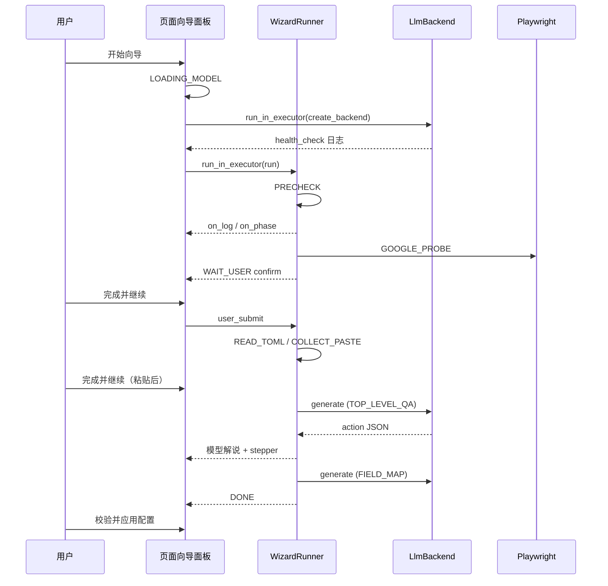

# Gemma 4 E4B · TOML 首次配置向导（应用层）

> 状态：v2.1（W5 页内向导 UX 设计；W0～W4 已实现；W5a 文档+线框+UI 壳）  
> 日期：2026-07-05  
> 依赖平台：`docs/embed_gemma4.md`（推理、Playwright、压缩、MCP）  
> 依赖业务：`docs/toml_config_design.md`、`docs/connect_google.md`、`app/core_toml.py`

---

## 1. 设计原则（小模型可完成）

Gemma 4 E4B（约 4B）**不能**可靠担任「任意 MCP + 自由 shell + 长链自主 Agent」。本向导采用：

| 原则 | 说明 |
|------|------|
| **最少 token 优先** | 选型标准：**同等准确度下，哪种执行路径进 LLM 的上下文更短**；Copilot 的 `Get-Content` 演示 **不是**默认方案 |
| **Python 状态机** | 步骤顺序、等待用户、跳过 Google 等由 `wizard/runner.py` 固定，不由 LLM 即兴编排 |
| **窄工具集** | 每步仅 1～3 个预定义 action；LLM 只输出 **结构化 JSON**（`action` + 参数） |
| **JSON → Python 直跑** | E4B 产出 JSON 后，**向导 Python 直接** `load_toml` / patch / `verify_toml`；**不**经 PowerShell/MCP 把整文件文本回灌上下文 |
| **代码校验** | 每次改 TOML 后必跑 `verify_toml`；regex 由 **`test_regex`** 试跑 |
| **人机检查点** | Google 连接、粘贴样例、确认写入前 **WAIT_USER**（页内操作区；见 §2.2） |
| **LLM 调用预算** | 单模板向导目标 **≤15 次** `generate()`（`prompts.MAX_LLM_CALLS`；含 thinking） |

E4B 适合：字段映射建议、regex **候选**、向用户解释下一步。  
E4B 不适合：读全文 TOML、看 MCP shell 输出、连续 30+ 次 tool 调用。

---

## 2. 触发条件

| 条件 | 行为 |
|------|------|
| 模板首次激活且 `ensure_exists` 刚生成默认 TOML | 可选弹出向导 |
| `verify_toml` 未通过且用户点击「向导配置」 | 启动向导 |
| 用户显式命令 | `python -m llm_gemma4 wizard --template Ginger_Lots` |

默认 TOML 生成仍由 **`app/core_toml.ensure_exists`** 完成，向导在其后运行。

### 2.1 NiceGUI 入口（输入配置 Tab）

| 项 | 说明 |
|----|------|
| 页面 | `nicegui_ui/pages/tab_toml.py` →「输入配置」Tab |
| 按钮 | **AI 配置向导**（`校验与应用` 与 `高级（TOML 全文）` 之间） |
| 点击 | 打开 **页内向导面板**（`open_in_app_wizard`）；非主路径不再弹出黑终端 |
| 启动选项 | 面板内可选：启用 LLM（`--llm`）、`profile`（cuda/cpu/openvino，默认 probe 首选）、从上次继续（`--resume`） |
| 主路径 | 同进程：`WizardRunner` 在后台线程 / `ui.run_in_executor` 运行；LLM 加载与阶段推进在 UI 可见 |
| 降级 | **高级 · 终端模式**（折叠）：`python -m llm_gemma4 wizard …` 子进程，仅供调试 / CI；见 §9 |
| 注意 | 需 NiceGUI 已运行（Playwright 配合 `输入` / `Google 连接` Tab）；关 LLM 时仅 W0～W3 |
| 完成后 | 面板显示 DONE；用户点 **校验并应用配置** 或面板内「应用配置」触发 `trigger_toml_save` |

线框见 `docs/nicegui_ui/nicegui_ui_toml.html`（含页内向导抽屉）。详细交互见 **§2.2**；后端接线见 **§13 W5**。

### 2.2 W5 页内向导 UI

**目标：** 用户在「输入配置」Tab 内完成首次 TOML 配置，全程有可见状态、模型解说、选项与确认按钮；**不以黑命令行窗口为主反馈渠道**。

#### 2.2.1 布局线框

```
┌─ AI 配置向导 ────────────────────────────────────────────────┐
│ 状态条: [● 运行中] 阶段: COLLECT_PASTE    LLM: cuda  调用 3/15 │
├──────────────────────────────────────────────────────────────┤
│ 阶段条 (stepper):                                              │
│   ✓ PRECHECK  ✓ GOOGLE  ● READ_TOML  ○ PASTE  ○ 字段  ○ 完成   │
├──────────────────────── 对话日志 (可滚动) ─────────────────────┤
│ [系统] 正在加载模型 Gemma4-E4B (cuda)…                         │
│ [向导] 环境检查通过：Playwright 已安装，NiceGUI 可达。           │
│ [向导] 请在「Google 连接」Tab 完成 OAuth，完成后点下方按钮。      │
│ [模型] 我已读取 TOML 摘要：work_sheet=List，42 个字段待映射…    │
├──────────────────────── 操作区 (action area) ─────────────────┤
│  （WAIT_USER · confirm）                                       │
│              [ 完成并继续 ]                                     │
│  或 （WAIT_USER · choice）                                     │
│  ○ 是，已连接 Google Sheet   ○ 否，跳过 Google 源   [ 确认 ]   │
└──────────────────────────────────────────────────────────────┘
```

| 区域 | NiceGUI 组件 | 职责 |
|------|--------------|------|
| 状态条 | `ui.badge` + `ui.label` + `ui.spinner` | 向导生命周期、当前 `WizardPhase`、profile、LLM 计数 |
| 阶段条 | `ui.stepper` 或水平 `ui.chip` 列表 | 对照 `WizardPhase` 枚举高亮当前步 |
| 对话日志 | `ui.scroll_area` + 消息行（系统 / 向导 / 模型） | 追加 `runner.messages`、LLM 解说、`WAIT_USER` 文案 |
| 操作区 | 动态：`ui.radio` / `ui.select` / `ui.button` | 响应 `ask_user` 与用户检查点（见 §2.2.3） |

面板载体：`ui.dialog`（全屏或 `max-w-3xl`）或右侧 `ui.drawer`；W5a 以 `ui.dialog` 壳为主。

#### 2.2.2 UI 状态机

页内壳层状态（与 `WizardPhase` 正交，管 **面板呈现**）：

```
IDLE
  → LOADING_MODEL      # --llm 时 create_backend；显示 spinner +「正在加载模型…」
  → RUNNING_PHASE      # executor 内 runner 推进；日志滚动；stepper 同步 phase
  → WAIT_USER          # runner 遇 WAIT_USER 或 ask_user；操作区展示控件；runner 挂起
  → RUNNING_PHASE      # 用户提交后继续（resume 同线程或回调注入答复）
  → ERROR              # 后端/解析/预算耗尽；展示错误 +「关闭 / 重试」
  → DONE               # phase=DONE；提示「校验并应用配置」
```

| UI 状态 | 用户可见 | 后台 |
|---------|----------|------|
| IDLE | 启动前选项（LLM / profile / resume） | 无 runner |
| LOADING_MODEL | 「正在加载模型…」+ spinner | `ui.run_in_executor(create_backend)` |
| RUNNING_PHASE | 日志追加、stepper 更新 | `WizardRunner.run` 单步或分步 `run_step`（W5b） |
| WAIT_USER | 操作区激活；主按钮禁用防误触 | runner 等待 `user_response` Future / 队列 |
| ERROR | 红色状态条 + 末条日志 | runner 已停；state 仍可读 `temp/wizard/*.json` |
| DONE | 绿色「向导完成」+ 可选「应用配置」 | `save_state` phase=DONE |

#### 2.2.3 `ask_user` 与 WAIT_USER 映射

`tools.dispatch(ask_user)` 今日返回 `{ ok, wait: true, question }`。W5b 扩展 **结构化** `ask_user`（prompt 与 parser 同步）：

| `kind` | LLM / runner 意图 | NiceGUI 控件 | 用户提交后 |
|--------|-------------------|--------------|------------|
| `choice` | 多选一（如 Google 已连？跳过？） | `ui.radio` 或 `ui.select` +「确认」 | 将选项 value 写入 `state.user_notes` / 恢复 runner |
| `confirm` | 需在外部完成操作（OAuth、粘贴样例） | 主按钮 **「完成并继续」** | `runner.resume_after_user()` |
| `message` | 告知即可 | `ui.notify` + 日志一行 | 自动继续（或 2s 后 `resume`） |

**固定 WAIT_USER（非 LLM）** 与上表对齐：

| 阶段 | 文案来源 | `kind` |
|------|----------|--------|
| GOOGLE_PROBE | `WAIT_USER: confirm Google Sheet connected` | `confirm` 或 `choice`（是/否/跳过） |
| COLLECT_PASTE | `WAIT_USER: paste sample in 输入 tab` | `confirm` |
| TOP_LEVEL_QA / FIELD_MAP | LLM `ask_user` | 按 JSON `kind` 渲染 |

#### 2.2.4 线程与回调桥接

```
tab_toml.open_in_app_wizard(session)
  → WizardUiController(session, options)
       on_log(line)           → append 对话日志（ui.timer / ui.context 安全更新）
       on_phase(phase)        → 更新 stepper
       on_ui_state(s)         → IDLE | LOADING_MODEL | …
       on_ask_user(payload)   → 切 WAIT_USER，填充操作区
       user_submit(answer)    → 唤醒挂起 runner（W5b）

后台：
  ui.run_in_executor(load_backend)     # 不阻塞 NiceGUI 事件循环
  ui.run_in_executor(runner.run)       # 或 W5b：分步 run_until_wait()
```

| 模块 | 变更（W5b） |
|------|-------------|
| `wizard/runner.py` | 可选 `callbacks: WizardCallbacks`；遇 WAIT_USER / `ask_user` 调用 `on_wait` 并 **阻塞**于 `threading.Event` 直至 UI 提交 |
| `nicegui_ui/wizard_panel.py`（新） | `WizardUiController`、日志/stepper/操作区 `@ui.refreshable` |
| `agent/wizard_runner.py` | 抽出 `create_runner(...)` 供 UI 与 CLI 共用 |

LLM 加载与推理细节见 `docs/embed_gemma4.md` §3（`LlmBackend` / `create_backend`）。

#### 2.2.5 子进程降级（仅调试）

| 项 | 说明 |
|----|------|
| 入口 | 向导面板底部「高级 · 在终端中运行（调试）」 |
| 行为 | 等同 v2.0：`CREATE_NEW_CONSOLE` 启动 CLI |
| 适用 | 开发者无 UI 壳时、`pytest`、远程 SSH |
| 产品默认 | **关闭**；文档与线框不以此为主路径 |

#### 2.2.6 Ginger_Lots 首次配置 — 编号流程

1. 用户左侧选模板 **Ginger_Lots**，打开「输入配置」→ **AI 配置向导**。
2. 面板 IDLE：勾选 LLM + profile **cuda**，点 **开始向导** → UI → `LOADING_MODEL`。
3. 日志：`正在加载模型…` → `health_check` 摘要 → `RUNNING_PHASE`。
4. **PRECHECK**：日志输出 node / playwright / nicegui；stepper 勾 PRECHECK。
5. **GOOGLE_PROBE**：Playwright 打开 Edge；日志提示 OAuth；操作区 **「完成并继续」** 或选「跳过 Google」→ 继续。
6. **READ_TOML**：日志打印 digest（非全文）；模型可选解说 `work_sheet` / 待映射字段数。
7. **COLLECT_PASTE**：提示去「输入」Tab 粘贴样例；用户粘贴后点 **完成并继续**；runner 再 `collect_input_tab` 采快照。
8. **TOP_LEVEL_QA**（LLM）：模型 `set_top_level` 或 `ask_user`；失败则日志显示 verify 错误。
9. **FIELD_MAP_LOOP**：每批最多 5 字段；日志显示 heuristic / patch；遇 `ask_user` 显示选项。
10. **FINAL_VERIFY** → **DONE**：状态条绿色；用户点 **校验并应用配置** 重建引擎。



---

## 3. 模块地图

```
llm_gemma4/
  __main__.py              # probe | download | smoke | wizard | chat | mcp
  agent/
    wizard_runner.py       # CLI wizard 入口：create_backend + WizardRunner
    context_store.py       # LLM 上下文分层
    context_config.py      # profile → n_ctx / 截断上限
    compressor.py          # 超预算时压缩 recent_turns
    loop.py                # chat ReAct（Phase 5，非向导）
  wizard/
    runner.py              # 状态机 INIT→DONE
    state.py               # WizardPhase 枚举 + temp/wizard/{id}.json
    action_parser.py       # E4B 回复 → 单 action JSON
    tools.py               # dispatch：9 action 路由
    toml_io.py             # digest / patch / backup / test_* / heuristics
    precheck.py            # Node / Playwright / NiceGUI HEAD
    prompts.py             # 阶段 prompt、MAX_LLM_CALLS=15、FIELD_BATCH_SIZE=5
  tools/
    browser_playwright.py  # NiceGuiBrowser · Edge channel
    browser_state.py       # PageState → 截断文本
  mcp/server.py            # MCP stdio 窄 tool 子集（Phase 5）
app/core_toml.py           # 业务只读：load_toml · verify_toml · TomlGenerator
temp/wizard/{template_id}.json   # 向导持久化状态
```

**TOML 读写实现位于 `llm_gemma4/wizard/toml_io.py`**（非 `app/`）。`app.core_toml` 仅提供 `load_toml`、`verify_toml`、`TomlGenerator`。

---

## 4. 向导阶段（状态机）

`WizardPhase` 定义于 `llm_gemma4/wizard/state.py`：

```
INIT
  → PRECHECK          # Playwright / Node / NiceGUI HEAD（无 LLM）
  → GOOGLE_PROBE      # Edge 打开 NiceGUI · Google 连接 Tab
  → [WAIT_USER]       # 用户：能否连 Google Sheet？（页内操作区；§2.2.3）
  → READ_TOML         # toml_io.read_toml_digest（非全文）
  → COLLECT_PASTE     # [WAIT_USER] Playwright 读「输入」Tab 粘贴区与表单快照
  → TOP_LEVEL_QA      # LLM（--llm）+ set_top_level patch · verify
  → FIELD_MAP_LOOP    # 启发式 index + LLM 映射 index/field/regex · 试工具 · patch_field
  → FINAL_VERIFY      # read_toml_digest · verify_ok 汇总
  → DONE
```

| 阶段 | 需要 LLM | 需要浏览器 | 说明 |
|------|----------|------------|------|
| INIT→PRECHECK | 否 | 否 | 自动推进 |
| PRECHECK | 否 | 否 | Playwright 缺失仅 WARN，仍进入 GOOGLE_PROBE |
| GOOGLE_PROBE | 否 | 是（可 `--skip-google` / `--no-browser` 跳过） | `skip_google` 时直接记 `user_notes.google=skipped` |
| READ_TOML | 否 | 否 | digest 写入 ContextStore tool observation |
| COLLECT_PASTE | 否 | 是 | `no_llm` 时本阶段结束后 **直接 DONE**；WAIT_USER → 页内「完成并继续」 |
| TOP_LEVEL_QA | 是 | 否 | verify 已通过则跳过 LLM |
| FIELD_MAP_LOOP | 是 | 否 | 每批 `FIELD_BATCH_SIZE=5`；先启发式再 LLM |
| FINAL_VERIFY | 否 | 否 | 打印 `verify_ok` 与 `llm_calls` |
| DONE | — | — | — |

**无 `WRITE_TOP` 独立阶段**：顶层写入在 `TOP_LEVEL_QA` 内通过 `dispatch(set_top_level)` 完成。

持久化：`temp/wizard/{template_id}.json`（`phase`、`skip_google`、`paste_sample`、`form_snapshot`、`regex_attempts`、`llm_calls`、`field_map_cursor`、`user_notes`），支持 `--resume`。

---

## 5. 逐步说明

### 5.1 PRECHECK — 环境（无 LLM）

实现：`llm_gemma4/wizard/precheck.py` → `run_precheck(base_url)`。

| 检查 | 实现 |
|------|------|
| Node.js | `shutil.which("node")` + `subprocess` 跑 `node --version`（可选，缺失仅 note） |
| Playwright | `import playwright`；缺失则 `issues` 提示 `pip install playwright && playwright install` |
| NiceGUI 可达 | `urllib` HEAD `http://127.0.0.1:8738/` |

`PrecheckReport.ok` 仅在 Playwright **未安装**时为 false；runner 仍打印 WARN 并进入 GOOGLE_PROBE。

**可选（仅 Cursor 人工调试）**：[PowerShell.MCP](https://github.com/yotsuda/PowerShell.MCP) 可在 IDE 注册，用于开发者手工试命令；**wizard 运行时 TOML 读写不依赖它**。

### 5.2 GOOGLE_PROBE — Google Sheet（Playwright Edge）

1. `NiceGuiBrowser.start()` → `chromium.launch(channel='msedge', headless=…)`
2. `probe_google_tab(template_id)` → `PageState.google_connected_hint`
3. 若未连接：打印 `docs/connect_google.md` 指引

**WAIT_USER**（页内 `confirm` / `choice`）：「confirm Google Sheet connected (yes/no)」

| 用户答复 / 标志 | 后续 |
|-----------------|------|
| `--skip-google` 或 `state.skip_google` | 跳过所有 Google 相关 TOML 项 |
| `google_hint` 为 `maybe_connected` / `connected_no_visible_rows` | 记 `user_notes.google=connected` |
| 其他 | 记 `not_connected`；后续可手工 OAuth 后 `--resume` |

### 5.3 READ_TOML — 读取当前配置

**唯一默认路径：Python**（省 token；E4B 不看磁盘原文）。

```python
from llm_gemma4.wizard import toml_io

payload = toml_io.read_toml_digest(template_id, template_xlsx)
# payload: { "digest", "verify_ok", "errors" }
```

`build_toml_digest` 只产出 **结构化摘要**，例如：

```text
work_sheet='List' print_sheet='label' fields=42 determiner='\t' db_id='order' unmapped_index=3
input_area='A2:F50'
verify_ok=False
errors: fields[3].regex empty; source_file missing …
pending_batch: ['order', 'qty', …]
```

**不进 LLM 上下文的内容：** 完整 `.toml` 原文、PowerShell `Get-Content` 输出、MCP `execute_command` 回显。

### 5.4 COLLECT_PASTE — 采集粘贴样例（WAIT_USER）

1. `browser.collect_input_tab(template_id)` → `paste_ghost_value`、`form_fields`
2. 写入 `state.paste_sample`、`state.form_snapshot`
3. 页内提示：`请在「输入」Tab 粘贴样例后点「完成并继续」`（等同 runner 日志 `WAIT_USER: paste sample…`）

`--no-browser` 时：仅用 state 中已有 `paste_sample`，或留空。

### 5.5 TOP_LEVEL_QA — 顶层参数

若 `verify_ok` 且无 errors → **跳过 LLM**。

否则 LLM（`thinking=False`）根据 digest 输出 JSON：

```json
{
  "action": "set_top_level",
  "patch": {
    "work_sheet": "List",
    "print_sheet": "label",
    "determiner": "\t",
    "db_id": "order",
    "input_section": { "input_area": "A2:F50", "move_to": "A1", "offset": 0 }
  }
}
```

白名单顶层键：`work_sheet`、`print_sheet`、`determiner`、`db_id`、`input_section`（`input_area` / `move_to` / `offset`）。  
`skip_google=true` 时 prompt 注明 `source_file` 留空。

写入后 **必须** `verify_toml`；失败回滚 `.bak`。

### 5.6 FIELD_MAP_LOOP — 字段与 regex（核心 LLM 环节）

每轮（最多 20 批）：

1. `toml_io.pending_field_labels(cfg)` → `index < 0` 的 `Input_label`
2. **启发式**（无 LLM）：`heuristic_field_index` 用 `form_snapshot` 值在 `paste_sample` 中匹配列 → `apply_patch`
3. 仍待映射的 batch（≤5）→ LLM（`thinking=True`）
4. LLM 可循环：`test_paste_split` / `test_regex` / `test_source_row` → 成功后 `patch_field`
5. 每字段最多 `MAX_FIELD_RETRIES=3` 次 LLM 轮；`regex_attempts` 保留最近 **12** 条
6. LLM 预算耗尽或 batch 未完成 → 打印 `unmapped remain` 并退出循环

---

## 6. JSON action 模式与 `tools.dispatch`

解析：`wizard/action_parser.py` → `parse_action(text)` 提取含 `"action"` 的单 JSON 对象。  
路由：`wizard/tools.py` → `dispatch(action, template_id=…, …)`。

### 6.1 全部 9 个 action

| `action` | 必填参数 | 可选参数 | 返回要点 |
|----------|----------|----------|----------|
| `read_toml` | — | — | `{ digest, verify_ok, errors }` |
| `set_top_level` | `patch` (object) | — | `{ ok, errors?, digest?, rolled_back? }` |
| `patch_field` | `input_label`, `updates` | — | 同上；`updates` 白名单：`index`, `field`, `regex`, `source_file`, `source_sheet`, `id` |
| `test_paste_split` | `index` | `paste_text`, `determiner` | `{ ok, value, part_count }` |
| `test_regex` | `pattern`, `sample` | `group` | `{ ok, value, groups }` |
| `test_source_row` | `source_file`, `source_sheet` | `keys`, `row_index` | `{ ok, row, row_index }` |
| `browser_snapshot` | — | — | `{ ok, page_state }`（需活跃 browser） |
| `browser_click` | `text` 或 `ref` | — | `{ ok, clicked, page_state }` |
| `ask_user` | `question` | `kind`（`choice` \| `confirm` \| `message`）、`options`（choice 时） | `{ ok, wait: true, question, kind? }` → UI **WAIT_USER**（§2.2.3） |

**单次 LLM 回复** 只允许 **一个** action JSON；解析失败抛 `ActionParseError`（runner 捕获并跳过该步）。

`WIZARD_SYSTEM`（`prompts.py`）列出的 LLM 侧 action 为前 6 个写 TOML/试跑类 + `ask_user`；`browser_*` 由 runner 在 Playwright 阶段直接调用，也可经 dispatch 供 chat/MCP 使用。

### 6.2 统一 TOML 写入流程

```
E4B → { "action": "set_top_level", "patch": { "work_sheet": "List" } }
  或 → { "action": "patch_field", "input_label": "order", "updates": { "index": 0 } }
  → tools.dispatch
  → toml_io.apply_patch
  → backup_toml → TomlGenerator.ConfigToToml 落盘
  → verify_toml(xlsx, cfg)
  → 失败 restore_backup；observation 仅 compact errors
```

observation 经 `_compact_observation` 截断至 `tool_observation_max_chars`（默认 2000）。

---

## 7. `toml_io.py` API

模块：`llm_gemma4/wizard/toml_io.py`（集成 `app.core_toml` + `app.core_transform`）。

| 函数 | 说明 |
|------|------|
| `resolve_template_xlsx(template_id)` | 经 `sort_templates.json` 或 `templates/*.xlsx` 解析 xlsx 路径 |
| `toml_path(template_id)` | `templates/{id}/{id}.toml` |
| `build_toml_digest(cfg, report?, pending_labels?)` | 结构化摘要字符串 |
| `read_toml_digest(template_id, template_xlsx?)` | load + verify + digest 字典 |
| `compact_verify_errors(report, limit=12)` | 短错误列表供 LLM |
| `backup_toml` / `restore_backup` | `.toml.bak.{YYYYMMDD_HHMMSS}` |
| `apply_patch(template_id, *, top_level?, field_label?, field_updates?, template_xlsx?)` | 内存 patch → 落盘 → verify；失败回滚 |
| `test_regex(pattern, sample, group?)` | `re.search` 试跑 |
| `test_paste_split(paste_text, index, determiner)` | `split(determiner)` 取列 |
| `test_source_row(template_id, source_file, source_sheet, keys?, row_index=0, …)` | `Template2DB` + `_load_sheet_rows` 拉一行 |
| `pending_field_labels(cfg)` | `index < 0` 的标签列表 |
| `field_batch_summary(cfg, labels)` | 当前 batch 紧凑描述 |
| `heuristic_field_index(input_label, paste_text, form_snapshot, determiner)` | 无 LLM 猜 `index` |
| `field_rule_for_label(cfg, input_label)` | 单条 `TomlDefault` |

---

## 8. ContextStore 与 LLM 预算

| 项 | 实现 |
|----|------|
| 预算上限 | `prompts.MAX_LLM_CALLS = 15`；`WizardState.llm_calls` 递增；`_llm_budget_left()` 耗尽则停止 FIELD_MAP |
| 上下文 | `agent/context_store.py`：system · task_anchor · tool_trace_summary · latest_browser_state · recent_turns |
| 配置 | `context_config_for_profile(profile)`：`n_ctx=8192`；cuda 略放宽 browser/dom 上限 |
| 压缩 | 向导结束若 `should_compress()` → `compressor.run()`：弹出最旧 turn → bullet 摘要；剥离 assistant thought 通道 |
| thinking | `TOP_LEVEL_QA`：`thinking=False`；`FIELD_MAP_LOOP`：`thinking=True` |
| 轨迹截断 | `tool_observation_max_chars=2000`；`browser_observation_max_chars` 6000（cuda 10000） |

| 内容 | 是否进 LLM 上下文 |
|------|-------------------|
| `WIZARD_SYSTEM` + 阶段 user prompt | 是 |
| paste 样例（≤400 字）+ batch `field_batch_summary` | 是 |
| digest + verify 错误 | 是 |
| 完整 TOML 原文 / shell 输出 | **否** |
| regex 试错（`regex_attempts` 最近条） | 压缩时保留摘要 |
| thought 全文 | **否**（`parse_thinking` 丢弃 thought 通道） |

---

## 9. CLI 示例

```bat
REM W0～W3：无 LLM、有浏览器（默认）
python -m llm_gemma4 wizard --template ginger_lots --headed

REM 跳过 Google 与浏览器（纯 TOML digest / patch smoke）
python -m llm_gemma4 wizard --template ginger_lots --skip-google --no-browser

REM 从上次状态继续（COLLECT_PASTE 后粘贴完成再跑）
python -m llm_gemma4 wizard --template ginger_lots --resume --headed

REM W4 完整 E4B 字段映射（需已 download + smoke 通过）
python -m llm_gemma4 wizard --template ginger_lots --llm --profile openvino --headed
python -m llm_gemma4 wizard --template ginger_lots --llm --profile cuda --headed

REM 指定 xlsx 覆盖路径
python -m llm_gemma4 wizard --template ginger_lots --template-xlsx templates/Ginger_Lots/ginger_lots.xlsx --llm --profile cpu
```

| 标志 | 默认 | 说明 |
|------|------|------|
| `--llm` | **关**（`no_llm=True`） | 开启后才加载 backend 并跑 TOP_LEVEL_QA / FIELD_MAP |
| `--profile` | `cpu`（仅 `--llm` 时加载模型） | `cpu` / `cuda` / `openvino` |
| `--headed` | headless | 显示 Edge 窗口（OAuth / 粘贴） |
| `--no-browser` | 开浏览器 | 跳过 Playwright 阶段 |
| `--skip-google` | 否 | 等同 `state.skip_google=true` |
| `--resume` | 否 | 读 `temp/wizard/{id}.json` |
| `--base-url` | `http://127.0.0.1:8738/` | NiceGUI 地址 |

子命令一览：`probe` · `download` · `smoke` · `wizard` · `chat` · `mcp`（见 `llm_gemma4/__main__.py`）。

---

## 10. Chat / MCP（Phase 5 简述）

与 **向导状态机分离**；用于调试与 IDE 集成，非 TOML 首次配置主路径。

| 模式 | 入口 | 编排 | 步数/预算 |
|------|------|------|-----------|
| **chat** | `python -m llm_gemma4 chat --profile cuda --task "…"` | `agent/loop.py` ReAct | `MAX_STEPS=8` |
| **mcp** | `python -m llm_gemma4 mcp` | `mcp/server.py` FastMCP stdio | 工具：`browser_snapshot`、`browser_click`、`read_toml_digest`、`read_file`、`list_files`、`test_regex` |

chat 复用 `wizard.tools.dispatch` 处理 TOML/browser action，并额外暴露 `file_config` 白名单读文件。  
**生产 TOML 配置请走 `wizard`**，保证 `verify_toml` 与阶段顺序。

---

## 11. 验收标准（向导）

1. 无 Google 时 `--skip-google`，最终 TOML 无有效 `source_file` 外链，且 `verify_toml` 通过  
2. 有 paste 样例时，启发式 + LLM 映射 `index`；人工抽测 ≥80% 正确（待实机 E2E 记录）  
3. 带 regex 字段经 `test_regex` 通过后才 `patch_field` 写入  
4. 全程 LLM 调用 ≤15 次（`state.llm_calls`；单测 FakeBackend 已覆盖）  
5. 任一步写入失败可回滚 `.bak`（`apply_patch` 单测已覆盖）  
6. 150U openvino 上单模板向导 ≤30 分钟（含用户等待）— **待实机**

自动化：`python -m pytest test/llm_gemma4/ -q` → **45 passed**。

---

## 12. 与平台文档关系

| 文档 | 职责 |
|------|------|
| `embed_gemma4.md` | LlmBackend、§3.1 模块树、§6.2 Python 指挥层、Playwright、Compressor |
| **本文件** | TOML 首次配置 **业务状态机**、JSON→Python 写 TOML、E4B 窄 action |
| `toml_config_design.md` | 字段语义与 verify 规则（只读引用） |
| `connect_google.md` | OAuth / Sheet 连接（GOOGLE_PROBE 引用） |

---

## 13. 分阶段实施（应用层 W0～W5）

| 阶段 | 内容 | 状态 | 验收 |
|------|------|------|------|
| **W0** | PRECHECK + `read_toml_digest` + `apply_patch` smoke | [x] | `wizard --no-browser`；`test_toml_io_*` |
| **W1** | GOOGLE_PROBE + `skip_google` + state 持久化 | [x] | `test_wizard_runner_*` |
| **W2** | COLLECT_PASTE（Playwright） | [x] | runner `_step_collect_paste` |
| **W3** | TOP_LEVEL_QA 骨架（verify 已过时跳过 LLM） | [x] | `--no-llm` 跑通至 DONE |
| **W4** | FIELD_MAP_LOOP + 启发式 + E4B + `test_regex`/`test_source_row` | [x] | FakeBackend 单测；`--llm` 实机待 wheel |
| **W5** | NiceGUI 页内向导（§2.2） | [ ] W5a 文档+线框+UI 壳；W5b 后端桥 | 见下表 |

### W5 待办

| 项 | 现状（v2.1） | 目标（W5b） | 负责模块 |
|----|--------------|-------------|----------|
| 主入口 | `open_in_app_wizard` UI 壳（占位日志） | 绑定 `WizardRunner` + executor | `tab_toml.py` · `wizard_panel.py` |
| LLM 加载 | 未加载 E4B | `LOADING_MODEL` + `run_in_executor(create_backend)` | `wizard_runner` · UI controller |
| 阶段进度 | 静态 stepper 示例 | 实时 `on_phase(WizardPhase)` | `runner.py` callbacks |
| 对话日志 | 演示文案 | 追加 `messages` + 模型解说 | `on_log` |
| `ask_user` / WAIT_USER | CLI `print`；tools 仅 `question` | `kind` + `ui.radio` / **完成并继续** / notify | `tools.py` · `runner.py` · panel |
| 用户恢复 | CLI `--resume` 手动 | `user_submit` 唤醒 `threading.Event` | `WizardCallbacks`（新） |
| 子进程 | v2.0 黑终端（已降级） | 仅「高级 · 终端模式」 | `_launch_wizard_subprocess` |
| 完成后刷新 | 用户手动「校验并应用」 | DONE 时可选一键 `trigger_toml_save` | `tab_toml.py` |
| 实机 E2E | FakeBackend 单测 | `--llm --profile openvino` 页内全链路 | 150U 验收 |

**W5a（本迭代）：** `gemma4_e4b_workflow.md` §2.1～§2.2、`nicegui_ui_toml.html` 线框、`open_in_app_wizard` 对话框壳。  
**W5b：** `WizardRunner` 分步/挂起、`WizardUiController` 接线、结构化 `ask_user`、实机 E2E。

平台 Phase 1～5 与 W 对齐见 `embed_gemma4.md` §11；**W0～W4 代码已落地**，W5a 文档与 UI 壳已对齐，W5b 为后端接线。
