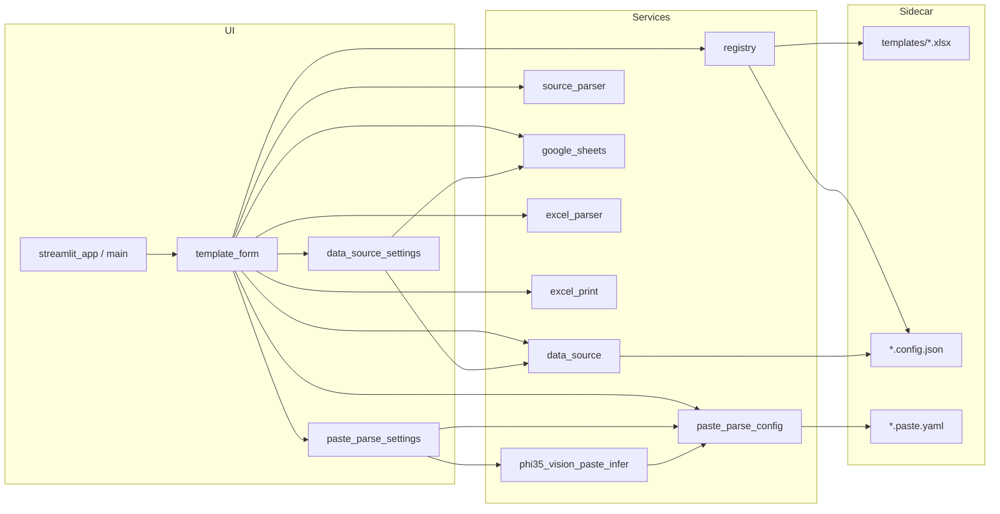

# Excel Template Viz — 项目概览（CodeGraph 风格快照）

> 快照日期：**2026-06-10** · 工作区：`e:\my_github\excel-template-viz`

本文档按 CodeGraph 约定整理。当前工作区未启用 CodeGraph MCP，本次为基于代码库的手工刷新。

---

## 项目定位

Streamlit 应用：将 Excel 模板（如 Ginger Lots）可视化为 Web 表单，支持 YAML 驱动制表符粘贴批量填表、Google Sheet 按 ID 查询填表、Phi-3.5 Vision 生成粘贴映射，并导出/打印 xlsx。每个模板通过 `templates/` 自动发现，配置保存在同名 sidecar JSON 与 `.paste.yaml`。

---

## 目录与模块

| 路径 | 职责 |
|------|------|
| `streamlit_app.py` | **应用入口**（须在项目根目录 `streamlit run`） |
| `app/main.py` | 侧边栏模板导航、关闭应用；路由至 `render_template_page` |
| `app/components/template_form.py` | 单模板页：`数据录入` / `粘贴映射` / `数据源` 三 Tab；PO 自动查询、源数据粘贴、Save As、打印预览 |
| `app/components/data_source_settings.py` | 模板页「数据源」Tab：Google 认证、连接测试、工作表/ID 列、列映射 |
| `app/components/paste_parse_settings.py` | 「粘贴映射」Tab：Phi-3.5 Vision 推理、YAML 编辑与保存 |
| `app/components/paste_image_button.py` | 粘贴截图自定义 Streamlit 组件（Python 桥接） |
| `app/components/paste_image_button_frontend/` | 上述组件前端（HTML/JS/CSS） |
| `app/services/registry.py` | 扫描 `templates/*.xlsx`，读写 sidecar `.config.json` |
| `app/services/data_source.py` | 读写 sidecar 内 `data_source` 字段 |
| `app/services/paste_parse_config.py` | 加载/保存 `.paste.yaml`；§4  schema 校验；`parse_text_with_config` |
| `app/services/phi35_vision_model.py` | Phi-3.5 OpenVINO 模型下载与加载 |
| `app/services/phi35_vision_paste_infer.py` | 截图 → §4 粘贴映射 YAML 推理 |
| `app/services/paste_mapping_infer.py` | **未引用（死代码）**：旧 HTML/MD 行推断，已被 §4 YAML 取代 |
| `app/services/excel_parser.py` | xlsx 读写、Spreadsheet ID 解析 |
| `app/services/excel_print.py` | 打印区域检测、导出持久化、PIL 预览图、Windows 打印对话框 |
| `app/services/export_naming.py` | 导出文件名 `template-IDs-data-time.xlsx` |
| `app/services/source_parser.py` | Sheet 行 → 表单字段；`merge_parsed_into_headers` |
| `app/services/google_sheets.py` | gspread 连接、预览、按 ID 查行 |
| `app/services/shutdown.py` | 后台 PID、优雅关闭 |
| `templates/` | 本地 xlsx + sidecar + `*.paste.yaml` |
| `credentials/` | OAuth 客户端 JSON（不入库） |
| `exports/` | Save As / 打印用导出 xlsx（不入库） |
| `plans/` | Speckit 规划文档 |

**已移除（2026-06-09 清理）：** `tests/`、`pyproject.toml`、`config/templates.json`、弃用 `*_zh.md`、侧边栏「添加数据源」入口。

---

## 入口点

| 类型 | 位置 | 说明 |
|------|------|------|
| Streamlit main | `streamlit_app.py` → `app.main.main` | `run.bat` 与手动启动均使用此路径 |
| 调试脚本 | `scripts/debug_vision_paste.py` | Phi-3.5 粘贴映射离线调试 |

**导入要点：** 不可执行 `streamlit run app/app.py`。须在项目根目录运行 `streamlit run streamlit_app.py`。

**依赖：** 仅以 `requirements.txt` + `pip install -r requirements.txt` 安装；无 pytest、无 `pyproject.toml`。

---

## 模板页 Tab 结构

| Tab | 组件 | 主要能力 |
|-----|------|----------|
| 数据录入 | `template_form._render_form_entry_tab` | 工作表选择、TSV 粘贴解析、多行编辑、ID 自动 Sheet 查询、Save As、打印预览 |
| 粘贴映射 | `paste_parse_settings.render_paste_mapping_tab` | Phi-3.5 Vision 截图推理、YAML 草稿编辑、保存至 `.paste.yaml` |
| 数据源 | `data_source_settings.render_data_sources_tab` | Google 认证、Sheet 测试、工作表/ID 列、列映射持久化 |

---

## 数据流



1. **模板发现：** `registry.load_templates()` 扫描 `templates/*.xlsx` → 侧边栏列出模板。
2. **制表符粘贴：** 用户粘贴 TSV → `paste_parse_config.parse_text_with_config`（读 `templates/<id>.paste.yaml`，§4 schema）→ `merge_parsed_into_headers` → 表单；解析失败不覆盖已有单元格。
3. **PO 自动查询：** 在 ID 字段（由 `.paste.yaml` 中 `ID: true` 或 sidecar `id_column` 映射决定）输入值，稳定 2 秒后 → `fetch_row_by_id` → `sheet_row_to_form_fields` → 表单。
4. **粘贴映射：** 截图 → Phi-3.5 Vision → 校验 §4 YAML → 保存 `.paste.yaml`。
5. **导出 / 打印：** Save As → `exports/` + 生成打印区域预览图；打印按钮 → Windows 打印对话框。

---

## Sidecar 配置结构

每个 `templates/<name>.xlsx` 对应 `<name>.config.json`（或 `<name>.json`）：

```json
{
  "display_name": "Ginger Lots",
  "description": "",
  "sheet_name": "",
  "header_row": 0,
  "data_start_row": 1,
  "data_source": {
    "sheet_url": "https://docs.google.com/spreadsheets/d/...",
    "spreadsheet_id": "...",
    "worksheet_name": "Sheet1",
    "id_column": "PO",
    "column_mappings": [
      { "source": "PO", "target": "P.O. No.", "kind": "sheet" }
    ]
  }
}
```

粘贴映射单独保存在 `templates/<name>.paste.yaml`（§4 schema，见 `plans/data_source_in_form_tab/spec.md` §4）：

```yaml
determiner: "tab"
order:
  - filed: "?"
    index: -1
P.O. No.:
  - ID: true
    filed: "PO"
    index: 0
Receiving Date:
  - filed: "recv. date"
    index: 12
    regex: '(\d{1,2}\/\d{1,2})'
```

规则要点：`determiner` 分隔符；每模板字段为顶层 key，值为 `-` 开头的规则列表；`filed` + 0-based `index`；可选 `regex` 提取；`ID: true` 标记自动 Sheet 查询字段；未知列用 `filed: "?"`、`index: -1`。

---

## 全局统计

| 指标 | 数值 |
|------|------|
| Python 源文件 | 18（`app/` 17 + `streamlit_app.py`） |
| 外部依赖 | streamlit, pandas, openpyxl, gspread, google-auth, PyYAML, Pillow, transformers, openvino, optimum-intel, huggingface-hub |

---

## 维护建议

1. **新模板：** 将 xlsx 复制到 `templates/`，无需注册表。
2. **数据源：** 在模板页「数据源」Tab 完成认证、测试与保存。
3. **粘贴：** 在「粘贴映射」Tab 配置 YAML，在「数据录入」Tab 粘贴并「解析并填入」。
4. **死代码清理：** 可删除未引用的 `paste_mapping_infer.py`。
5. **刷新本文档：** 大改架构后手工更新本文件，或启用 CodeGraph MCP 后自动再生。
