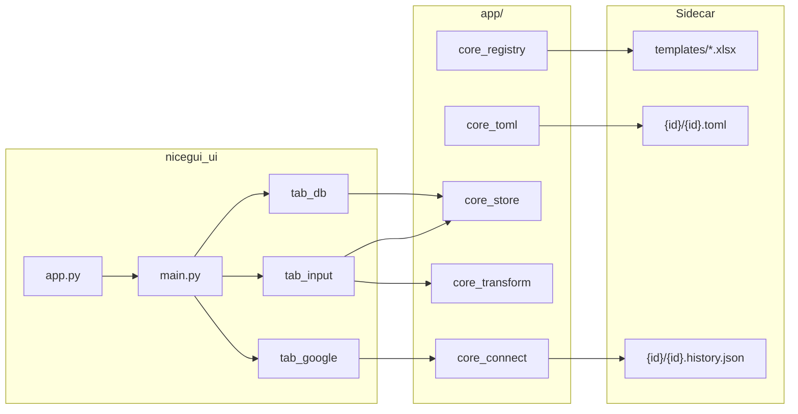

# Excel Template Viz — 项目概览（CodeGraph 风格快照）

> 快照日期：**2026-07-04** · 工作区：`e:\my_github\excel-template-viz`

本文档按 CodeGraph 约定整理。依赖图由 `codegraph` CLI 导出至 `plans/codegraph.csv` 与 `plans/codegraph.html`（当前扫描范围：`app/`）；结构变更后请重新运行导出命令。

---

## 项目定位

NiceGUI 应用：将 Excel 模板（如 Ginger Lots）可视化为 Web 表单，支持 TOML 驱动字段规则、Google Sheet 按 ID 查询填表、Gemma 4 智能字段匹配，并导出/打印 xlsx。每个模板通过 `templates/` 自动发现，配置分散在模板子目录 sidecar 文件中。

**UI 入口：** `python -m nicegui_ui.app`（默认端口 **8738**）。

**已废弃：** Gradio UI 层、`.paste.yaml` / `paste_parse_config.py` 粘贴映射体系；字段规则统一由 `{id}.toml` 与 `core_toml` 承担。

---

## 目录与模块

| 路径 | 职责 |
|------|------|
| `nicegui_ui/app.py` | **应用入口**；`ui.run()`、storage_secret、页面路由 |
| `nicegui_ui/pages/main.py` | 主壳：`ui.splitter` 侧边栏 + Tab 工作区 |
| `nicegui_ui/pages/tab_input.py` | 「输入」Tab：幽灵粘贴框、动态字段、session 表、另存为/下一行 |
| `nicegui_ui/pages/tab_toml.py` | 「输入配置」Tab：TOML 编辑与校验 |
| `nicegui_ui/pages/tab_db.py` | 「存储配置」Tab：库切换、全部数据表、覆盖录入 |
| `nicegui_ui/pages/tab_google.py` | 「Google 连接」Tab：OAuth、主 ID 表、导入/屏蔽 |
| `nicegui_ui/components/for_main.py` | 模板加载全链路（TOML → verify → 重建引擎）、主键 ID 查询 |
| `nicegui_ui/components/session.py` | `SessionRegistry` / `SessionState` 按 principal 隔离 |
| `app/core_registry.py` | 扫描 `templates/*.xlsx`，模板时间线排序 |
| `app/core_toml.py` | TOML 加载/校验/生成；`resolve_db_id`、`verify_toml` |
| `app/core_store.py` | `SecureSQLite` + `UiProvider`；`templates/{id}/{id}.{Letter}{Year}` 落库 |
| `app/core_transform.py` | `Template2DB`、`ExcelWriter`；xlsx 回写与实例容量 |
| `app/core_connect.py` | `ConnectGoogle`；OAuth、Sheet 拉取、trash 历史 |
| `app/gemma4_field_matcher.py` | Gemma 4 GGUF 字段匹配（llama-cpp-python，CPU） |
| `app/cpu_features.py` | SIMD 检测与 llama-cpp wheel 推荐 |
| `app/download_gemma4_model.py` | 下载 Gemma 4 GGUF 权重至 `models/gemma4/` |
| `templates/{id}/` | 模板 sidecar：`{id}.toml`、`.history.json` |
| `docs/connect_google.md` | Google 连接与 TOML `[[sources]]` 设计说明 |
| `plans/nicegui_ui_migration/` | NiceGUI 迁移 Speckit |
| `.cursor/rules/nicegui-usage.mdc` | NiceGUI 布局、状态、事件约定 |
| `.cursor/rules/codegraph-usage.mdc` | 结构/依赖分析优先用 CodeGraph |

---

## 入口点

| 类型 | 位置 | 说明 |
|------|------|------|
| NiceGUI main | `nicegui_ui/app.py` | `python -m nicegui_ui.app` |
| 模型下载 | `app/download_gemma4_model.py` | 首次 LLM 使用前下载 GGUF |
| E2E 冒烟 | `scratch_e2e_firefox.py` | Playwright Firefox 全流程（非 CI） |

---

## 数据流（当前）



1. **模板发现：** `SortTemplates` 扫描 `templates/*.xlsx` → 侧边栏列表。
2. **模板激活：** 加载 TOML → `verify_toml` → 重建 `SecureSQLite` / `UiProvider` / `Template2DB` / `ExcelWriter`。
3. **Google 连接：** `ConnectGoogle` + TOML `[[sources]]`；主 ID 表导入 → `persist_fields` → `session_rows`。
4. **输入/粘贴：** `UiProvider.record_from_textbox` 按 `determiner` 拆分；主键 blur → `query_by_id`。
5. **落库：** 「另存为」前 `persist_fields` 写入 `templates/{id}/{id}.{Letter}{Year}`；`records.id` 取自 TOML `id=true` 字段，否则 `_auto_records_id()`。
6. **导出：** 「另存为」→ `exports/{template_id}/{template_id}_{suffix}_{timestamp}.xlsx`。

---

## 模板配置结构

每个模板 `templates/{template_id}/` 目录：

| 文件 | 用途 |
|------|------|
| `{id}.xlsx` | Excel 模板 |
| `{id}.toml`（小写 stem） | `determiner`、`[[sources]]`、`[[fields]]`、`[[input_section]]` |
| `{id}.history.json` | Google 导入 `trash_ids`（屏蔽列表） |

---

## 关键 API（`app/`）

| 模块 | 符号 | 用途 |
|------|------|------|
| `core_toml` | `load_toml` / `verify_toml` | TOML 加载与校验报告 |
| `core_toml` | `resolve_db_id` | 解析 `id=true` 字段 → `records.id` |
| `core_store` | `SecureSQLite.insert_or_update` | JSON payload 落库 |
| `core_store` | `UiProvider.record_from_textbox` | 粘贴行 → 字段 dict |
| `core_store` | `_auto_records_id` | 无主键时的 SQLite 安全自增 ID |
| `core_transform` | `ExcelWriter.write_back` | 多行写回 xlsx |
| `core_transform` | `Template2DB.fetch_row_by_id` | 外部 Sheet 按 ID 拉行 |
| `core_connect` | `ConnectGoogle` | OAuth、预览表、字段抓取 |
| `core_connect` | `load_trash_history` / `save_trash_history` | 屏蔽 ID 列表 |
| `gemma4_field_matcher` | `batch_match_all_fields` | LLM 批量字段映射 |

---

## 全局统计

| 指标 | 数值 |
|------|------|
| `app/` Python 模块 | 9（含 `download_gemma4_model.py`） |
| `nicegui_ui/` Python 模块 | ~12（pages + components，未纳入本次 CSV） |
| CodeGraph CLI 实体 | **147**（`plans/codegraph.csv`，2026-07-04） |
| 活跃 Speckit 计划 | `nicegui_ui_migration`、`llm_field_matching_optimization` |
| LLM | Gemma 4 E4B Q4_0 GGUF（llama-cpp-python，CPU） |

---

## 维护建议

1. **新模板：** xlsx 放入 `templates/`，子目录放 `{stem}.toml` 与可选 `.history.json`。
2. **Google：** 「Google 连接」Tab；URL 写在 TOML `[[sources]]`，见 `docs/connect_google.md`。
3. **字段规则：** 「输入配置」Tab 编辑 TOML；保存后重建全部引擎。
4. **MCP（Cursor Agent，推荐）：** `~/.cursor/mcp.json` 使用 `@astudioplus/codegraph-mcp`，参数 **`-w <repo>`** 即可（**不要**再写 `--mcp`，会与包内默认重复报错）；**不要**在同一进程加 `--watch`。
5. **保存即索引（可选）：** 另开终端运行 `.\scripts\codegraph_watch.ps1`，后台 `--watch` 增量更新 `~/.codegraph`。
6. **Agent 验收未提交改动：** `codegraph_reindex_workspace` → `codegraph_symbol_search` / `codegraph_get_ai_context`。
7. **刷新静态 CSV/HTML 快照（旧 CLI，仅 `app/`）：**

```bash
PYTHONUTF8=1 codegraph app --output plans/codegraph.html
PYTHONUTF8=1 codegraph app --csv plans/codegraph.csv
```

8. 更新本概览中的快照日期与实体计数。
