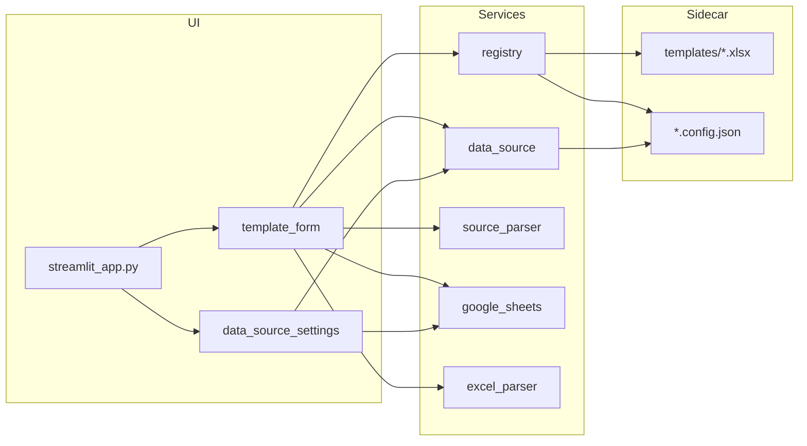

# Excel Template Viz — 项目概览（CodeGraph 风格快照）

> 快照日期：**2026-06-08** · 工作区：`e:\my_github\excel-template-viz`

本文档按 [CodeGraph 约定](https://github.com/) 整理。当前工作区未启用 CodeGraph MCP，本次为基于代码库的手工刷新；启用后可执行 `codegraph_reindex_workspace` 与 `codegraph_generate_architecture_doc` 自动再生。

---

## 项目定位

Streamlit 应用：将 Excel 模板（如 GIN LOT List）可视化为 Web 表单，支持制表符粘贴批量填表、Google Sheet 按 PO 查询填表，并导出更新后的 xlsx。每个模板通过 `templates/` 自动发现，配置与数据源保存在同名 sidecar JSON。填写侧提供 **数据源** Tab，集中展示全部模板的数据源配置。

---

## 目录与模块

| 路径 | 职责 |
|------|------|
| `streamlit_app.py` | **应用入口**（须在项目根目录 `streamlit run`） |
| `app/main.py` | 侧边栏导航、数据源设置区、模板页路由 |
| `app/components/template_form.py` | 单模板表单：`数据录入` / `数据源` 双 Tab；PO 查询、源数据粘贴、导出 |
| `app/components/data_source_settings.py` | 侧边栏「添加数据源」；填写侧 `render_data_sources_tab` 汇总展示 |
| `app/services/registry.py` | 扫描 `templates/*.xlsx`，读写 sidecar `.config.json` / `.json` |
| `app/services/data_source.py` | 读写 sidecar 内 `data_source` 字段；`list_template_data_sources()` 汇总 |
| `app/services/excel_parser.py` | xlsx 读写、Spreadsheet ID 解析 |
| `app/services/source_parser.py` | 制表符行 / Sheet 行 → 表单字段映射 |
| `app/services/google_sheets.py` | gspread 连接、预览、按 ID 查行 |
| `app/services/export_naming.py` | 导出文件名生成（PO + 日期） |
| `app/services/shutdown.py` | 后台 PID、优雅关闭 |
| `templates/` | 本地 xlsx 模板 + 同名 sidecar 配置（如 `Ginger_Lots.config.json`） |
| `credentials/` | OAuth 客户端 JSON（不入库） |
| `config/templates.json` | **已弃用**，应用不再读取 |
| `plans/` | Speckit 规划文档（含 `template_auto_discovery`） |
| `tests/` | pytest 单元测试（7 个测试文件） |

---

## 入口点

| 类型 | 位置 | 说明 |
|------|------|------|
| Streamlit main | `streamlit_app.py` → `app.main.main` | `run.bat` 与手动启动均使用此路径 |
| CLI 测试 | `pytest` | `pyproject.toml` 中 `pythonpath = ["."]` |

**导入要点：** 不可执行 `streamlit run app/app.py`。脚本位于 `app/` 内时 Python 将 `app` 解析为 `app.py` 模块而非包，导致 `from app.components...` 失败。

---

## 数据流



1. **模板发现：** 启动时 `registry.load_templates()` 扫描 `templates/*.xlsx` → 缺失 sidecar 时自动创建 `<name>.config.json` → 侧边栏列出模板。
2. **制表符粘贴：** 用户粘贴 Tab 分隔行 → `parse_source_text` → `merge_parsed_into_headers` → 表单。
3. **PO 查询：** sidecar 中 `data_source` + 会话内 Google 凭证 → `fetch_row_by_id` → `sheet_row_to_form_fields` → 表单。
4. **数据源汇总：** `数据源` Tab → `list_template_data_sources()` → 表格展示全部模板配置；当前模板可预览 Sheet。
5. **导出：** 表单行 → `write_template_sheet` → 下载 xlsx。

---

## Sidecar 配置结构

每个 `templates/<name>.xlsx` 对应 `<name>.config.json`（或 `<name>.json`）：

```json
{
  "display_name": "Ginger Lots",
  "description": "",
  "sheet_name": "",
  "header_row": 0,
  "data_start_row": 1,
  "data_source": {
    "sheet_url": "https://docs.google.com/spreadsheets/d/...",
    "spreadsheet_id": "...",
    "worksheet_name": "Sheet1",
    "id_column": "PO"
  }
}
```

`data_source` 可选；以 `spreadsheet_id` 是否存在判断是否已配置。

---

## Google Sheet 列映射（GIN LOT）

| Sheet 列 | 表单字段 |
|----------|----------|
| PO（可配置 ID 列名） | P.O. No. |
| Container# | Container No. |
| recv. date | YY / MM / DD / Receiving Date |

手动填写：`Container Seal No.`、`Lot No.`

---

## 全局统计

| 指标 | 数值 |
|------|------|
| Python 源文件（`app/`） | 13 |
| 测试文件 | 7 |
| 外部依赖 | streamlit, pandas, openpyxl, gspread, google-auth, google-auth-oauthlib |

---

## 维护建议

1. **新模板：** 将 xlsx 复制到 `templates/`，无需编辑任何注册表；首次访问自动生成 sidecar 配置。
2. **数据源：** 侧边栏「添加数据源」编辑当前模板；填写侧「数据源」Tab 查看全部模板汇总。
3. **列映射：** 优先改 `app/services/source_parser.py` 中常量与 `sheet_row_to_form_fields`。
4. **刷新本文档：** 在 Cursor 中启用 CodeGraph MCP 后，对 Agent 说：「对 excel-template-viz 执行 `codegraph_reindex_workspace` 与 `codegraph_generate_architecture_doc`，并更新 `plans/CODEGRAPH_OVERVIEW.md`。」
