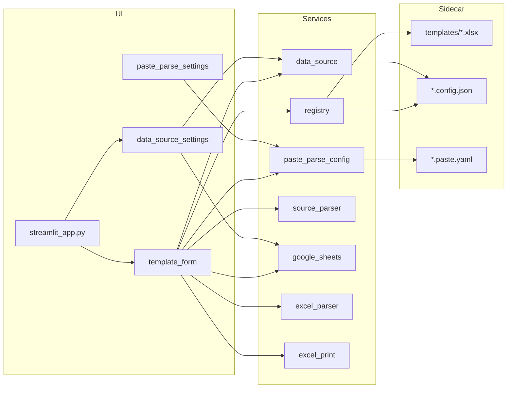

# Excel Template Viz — 项目概览（CodeGraph 风格快照）

> 快照日期：**2026-06-09** · 工作区：`e:\my_github\excel-template-viz`

本文档按 CodeGraph 约定整理。当前工作区未启用 CodeGraph MCP，本次为基于代码库的手工刷新。

---

## 项目定位

Streamlit 应用：将 Excel 模板（如 Ginger Lots）可视化为 Web 表单，支持 YAML 驱动制表符粘贴批量填表、Google Sheet 按 ID 查询填表、Phi-3.5 Vision 生成粘贴映射，并导出/打印 xlsx。每个模板通过 `templates/` 自动发现，配置保存在同名 sidecar JSON 与 `.paste.yaml`。

---

## 目录与模块

| 路径 | 职责 |
|------|------|
| `streamlit_app.py` | **应用入口**（须在项目根目录 `streamlit run`） |
| `app/main.py` | 侧边栏导航、数据源设置区、模板页路由 |
| `app/components/template_form.py` | 单模板表单：`数据录入` / `数据源` / `粘贴映射` Tab；PO 查询、源数据粘贴、Save As、打印 |
| `app/components/data_source_settings.py` | 侧边栏「添加数据源」；填写侧 `render_data_sources_tab` |
| `app/components/paste_parse_settings.py` | 粘贴映射 Tab：Phi-3.5 Vision、YAML 编辑 |
| `app/components/paste_image_button.py` | 粘贴截图自定义 Streamlit 组件 |
| `app/services/registry.py` | 扫描 `templates/*.xlsx`，读写 sidecar `.config.json` |
| `app/services/data_source.py` | 读写 sidecar 内 `data_source` 字段 |
| `app/services/paste_parse_config.py` | 加载/保存 `.paste.yaml`，`parse_text_with_config` |
| `app/services/phi35_vision_model.py` | Phi-3.5 OpenVINO 模型下载与加载 |
| `app/services/phi35_vision_paste_infer.py` | 截图 → 粘贴映射 YAML 推理 |
| `app/services/excel_parser.py` | xlsx 读写、Spreadsheet ID 解析 |
| `app/services/excel_print.py` | 打印区域检测、openpyxl 读取、Windows 打印对话框 |
| `app/services/export_naming.py` | 导出文件名 `template-IDs-data-time.xlsx` |
| `app/services/source_parser.py` | Sheet 行 → 表单字段；`merge_parsed_into_headers` |
| `app/services/google_sheets.py` | gspread 连接、预览、按 ID 查行 |
| `app/services/shutdown.py` | 后台 PID、优雅关闭 |
| `templates/` | 本地 xlsx + sidecar + `*.paste.yaml` |
| `credentials/` | OAuth 客户端 JSON（不入库） |
| `exports/` | Save As / 打印用导出 xlsx（不入库） |
| `plans/` | Speckit 规划文档 |

**已移除（2026-06-09 清理）：** `tests/`、`pyproject.toml`、`config/templates.json`、弃用 `*_zh.md`。

---

## 入口点

| 类型 | 位置 | 说明 |
|------|------|------|
| Streamlit main | `streamlit_app.py` → `app.main.main` | `run.bat` 与手动启动均使用此路径 |
| 调试脚本 | `scripts/debug_vision_paste.py` | Phi-3.5 粘贴映射离线调试 |

**导入要点：** 不可执行 `streamlit run app/app.py`。须在项目根目录运行 `streamlit run streamlit_app.py`。

**依赖：** 仅以 `requirements.txt` + `pip install -r requirements.txt` 安装；无 pytest、无 `pyproject.toml`。

---

## 数据流



1. **模板发现：** `registry.load_templates()` 扫描 `templates/*.xlsx` → 侧边栏列出模板。
2. **制表符粘贴：** 用户粘贴 TSV → `paste_parse_config.parse_text_with_config`（读 `templates/<id>.paste.yaml`）→ `merge_parsed_into_headers` → 表单。
3. **PO 查询：** sidecar 中 `data_source` + Google 凭证 → `fetch_row_by_id` → `sheet_row_to_form_fields` → 表单。
4. **粘贴映射：** 截图 → Phi-3.5 Vision → 保存 `.paste.yaml`。
5. **导出 / 打印：** Save As → `exports/`；打印 → openpyxl 读区域 + Windows 打印对话框。

---

## Sidecar 配置结构

每个 `templates/<name>.xlsx` 对应 `<name>.config.json`（或 `<name>.json`）：

```json
{
  "display_name": "Ginger Lots",
  "description": "",
  "sheet_name": "",
  "header_row": 0,
  "data_start_row": 1,
  "data_source": {
    "sheet_url": "https://docs.google.com/spreadsheets/d/...",
    "spreadsheet_id": "...",
    "worksheet_name": "Sheet1",
    "id_column": "PO"
  }
}
```

粘贴映射单独保存在 `templates/<name>.paste.yaml`（见 `plans/data_source_in_form_tab/spec.md` §4）。

---

## 全局统计

| 指标 | 数值 |
|------|------|
| Python 源文件（`app/`） | 17+ |
| 外部依赖 | streamlit, pandas, openpyxl, gspread, google-auth, PyYAML, Pillow, transformers, openvino, optimum-intel |

---

## 维护建议

1. **新模板：** 将 xlsx 复制到 `templates/`，无需注册表。
2. **数据源：** 侧边栏「添加数据源」或填写侧「数据源」Tab。
3. **粘贴：** 在「粘贴映射」Tab 配置 YAML，在「数据录入」Tab 粘贴并 Parse & fill。
4. **刷新本文档：** 大改架构后手工更新本文件，或启用 CodeGraph MCP 后自动再生。
