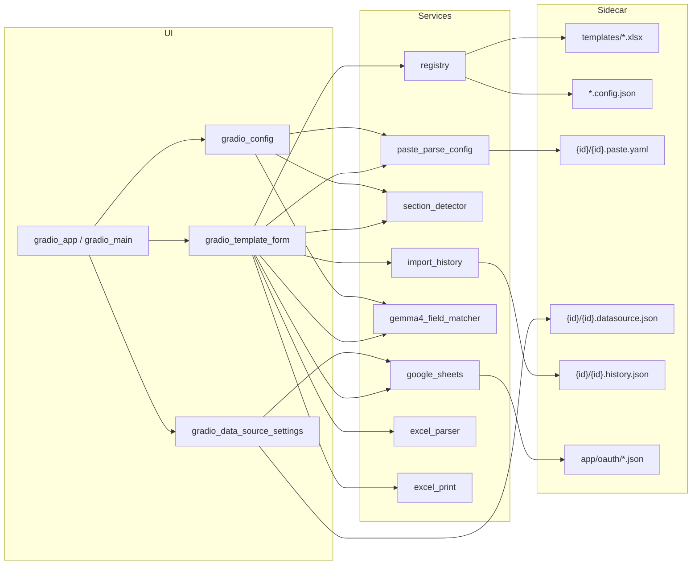

# Excel Template Viz — 项目概览（CodeGraph 风格快照）

> 快照日期：**2026-06-14** · 工作区：`e:\my_github\excel-template-viz` · 分支：**gradio-ui**

本文档按 CodeGraph 约定整理。依赖图由 `codegraph` CLI（v1.2.0）导出至 `plans/codegraph.csv` 与 `plans/codegraph.html`；结构变更后请重新运行导出命令。

---

## 项目定位

Gradio 4.0+ 应用：将 Excel 模板（如 Ginger Lots）可视化为 Web 表单，支持多区域检测、YAML 驱动批量导入、Google Sheet 按 ID 查询填表、Gemma 4 智能字段匹配，并导出/打印 xlsx。每个模板通过 `templates/` 自动发现，配置分散在模板子目录 sidecar 文件中。

**LLM 约束：** `google/gemma-4-E4B-it-qat-mobile-transformers` · **E4B** · **Transformers + safetensors** · **CPU 推理**（权重在 `models/gemma4/model.safetensors`）。

---

## 目录与模块

| 路径 | 职责 |
|------|------|
| `gradio_app.py` | **应用入口**（`run.bat` / `python gradio_app.py`） |
| `app/gradio_main.py` | 构建 `gr.Blocks`：模板侧边栏、三 Tab 布局、全局 `gr.State`、关闭应用 |
| `app/components/gradio_template_form.py` | 「数据录入」Tab：动态表单、多区域选择、ID 查表、批量导入/历史管理、导出 |
| `app/components/gradio_data_source_settings.py` | 「数据源」Tab：OAuth 授权/撤销、Sheet 连接、工作表/ID 列配置 |
| `app/components/gradio_config.py` | 「参数配置」Tab：区域配置、YAML 编辑、Gemma 4 LLM 测试与自动配置（**批量匹配**） |
| `app/services/registry.py` | 扫描 `templates/*.xlsx`，读写 sidecar `.config.json` |
| `app/services/data_source.py` | 读写 `templates/{id}/{id}.datasource.json` |
| `app/services/paste_parse_config.py` | `.paste.yaml` 加载/保存/校验；TSV 解析；Sheet 行映射；多区域 sections |
| `app/services/section_detector.py` | 多区域检测：解析 YAML sections、扫描 Excel 重复区域 |
| `app/services/import_history.py` | 批量导入历史：`processed_ids` / `trash_ids` → `.history.json` |
| `app/services/gemma4_field_matcher.py` | Gemma 4 E4B 字段匹配（Transformers + safetensors，本地 CPU；含 `batch_match_all_fields`） |
| `app/services/google_sheets.py` | OAuth 桌面流、gspread 连接、Polars 预览/全量、按 ID 查行、缓存 |
| `app/services/excel_parser.py` | xlsx 读写、Spreadsheet ID 解析 |
| `app/services/excel_print.py` | 打印区域检测、导出持久化、PIL 预览图、Windows 打印对话框 |
| `app/services/export_naming.py` | 导出文件名 `template-IDs-data-time.xlsx` |
| `app/oauth/` | OAuth 客户端与 token（`oauth_client.json`、`authorized_user.json`，**不入库**） |
| `scripts/download_gemma4_model.py` | 下载 Gemma 4 权重至 `models/gemma4/` |
| `templates/{id}/` | 模板 sidecar：`.paste.yaml`、`.datasource.json`、`.history.json` |
| `models/gemma4/` | Gemma 4 safetensors 权重（不入库） |
| `docs/llm_matching_flow.md` | LLM 匹配流程与批量 Prompt 设计 |
| `plans/gradio_ui_migration/` | Gradio 迁移 Speckit（plan / spec / tasks / constitution） |
| `plans/llm_field_matching_optimization/` | LLM 匹配优化 Speckit（进度、批量匹配、regex 建议） |
| `plans/batch_llm_matching/` | 批量 LLM 匹配 Speckit（已实现于 `gradio_config` / `gemma4_field_matcher`） |
| `.cursor/rules/gradio-usage.mdc` | Gradio 状态管理与 UI 交互约定 |
| `.cursor/rules/codegraph-usage.mdc` | 结构/依赖分析优先用 CodeGraph |
| `.cursor/rules/speckit-usage.mdc` | Speckit 计划目录与文档语言规范 |

**已删除遗留 Streamlit / Phi-3.5 / Phi-4 模块（2026-06-14）：** `app/main.py`、`template_form.py`、`data_source_settings.py`、`paste_parse_settings.py`、`paste_image_button.py`（含 frontend）、`phi35_vision_model.py`、`phi35_vision_paste_infer.py`、`source_parser.py`、`paste_mapping_infer.py`、`shutdown.py`、`app/services/phi4_field_matcher.py`、`scripts/download_phi4_model.py`。

---

## 入口点

| 类型 | 位置 | 说明 |
|------|------|------|
| Gradio main | `gradio_app.py` → `app.gradio_main.build_app` | `run.bat` 启动路径 |
| 模型下载 | `scripts/download_gemma4_model.py` | 首次 LLM 使用前下载 safetensors |
| 测试 | `tests/test_refactoring.py` | 核心服务回归 |
| 测试 | `tests/test_column_filtering.py` | 列过滤逻辑 |
| 测试 | `tests/test_llm_improvements.py` | LLM 测试输出与改进 |
| 测试 | `tests/test_batch_llm_matching.py` | Gemma 4 批量匹配与 matcher 行为 |

**启动：** 项目根目录 `python gradio_app.py` 或 `run.bat`（需 `.venv`），端口 **8501**。

**依赖：** `requirements.txt` — gradio, pandas, polars, openpyxl, gspread, PyYAML, torch, transformers, gguf, huggingface-hub, psutil, google-auth-oauthlib。

---

## 应用布局与 Tab 结构

```
┌─────────────────────────────────────────────────────┐
│  Excel 模板可视化                    [关闭应用]      │
├──────────┬──────────────────────────────────────────┤
│ 选择模板  │  [数据录入] [数据源] [参数配置]           │
│ (Radio)  │                                          │
│ [隐藏模板]│  Tab 内容区                               │
└──────────┴──────────────────────────────────────────┘
```

| Tab | 组件 | 主要能力 |
|-----|------|----------|
| 数据录入 | `gradio_template_form.build_form_tab` | 工作表选择、多区域表单、ID 自动 Sheet 查询、批量导入预览、已处理/回收站、Save As、打印预览 |
| 数据源 | `gradio_data_source_settings.build_datasource_tab` | OAuth 授权向导、Sheet 连接、工作表/ID 列持久化、测试查询 |
| 参数配置 | `gradio_config.build_config_tab` | 子 Tab：区域配置 / YAML 编辑 / Gemma 4 LLM 字段匹配测试与「自动配置」（批量 Prompt） |

**全局状态（`gr.State`）：** `current_template`、`credentials_state`、`form_data_state`、`detected_areas_state`、`sidebar_visible`。

---

## Google OAuth 与数据源

| 步骤 | 实现 |
|------|------|
| 上传 OAuth 客户端 JSON | `save_oauth_client_json` → `app/oauth/oauth_client.json` |
| 浏览器授权 | `run_oauth_flow`（桌面 InstalledAppFlow） |
| Token 缓存 | `app/oauth/authorized_user.json` |
| 撤销/删除配置 | `remove_stored_oauth` |
| 自动加载凭证 | `authenticate_google_sheets_desktop` / `_load_cached_credentials` |
| 按模板持久化 Sheet | `templates/{id}/{id}.datasource.json` |

UI 侧：`handle_oauth_start`、`handle_oauth_revoke`、`handle_sheet_connect`（`gradio_data_source_settings.py`）。OAuth 凭据目录整目录 gitignore，禁止提交密钥。

---

## LLM 字段匹配

| 维度 | 实现 |
|------|------|
| 批量推理 | `Gemma4FieldMatcher.batch_match_all_fields` — 单次 Prompt 映射全部 YAML 字段 |
| 调用方 | `gradio_config.handle_llm_test`、`handle_yaml_auto_config` |
| 逐字段回退 | `iter_match_sheet_fields_to_yaml` / `_llm_match_column`（批量导入 Tab 仍用） |
| 样本行 | ≥5 行，`prepare_batch_input` → `SourceColumnData` |
| Prompt | `_build_batch_field_mapping_prompt` |
| 精确匹配 | 列名 / hint 精确命中作为批量推理前置步骤 |
| 进度 | `ProgressStage` + Gradio `progress` 回调 |
| 格式转换 | `detect_format_mismatches` + `infer_transformations_for_mismatches`（第二阶段） |

**相关符号：** `batch_match_all_fields`、`prepare_batch_input`、`get_or_create_field_matcher`、`ensure_model_downloaded`、`iter_match_sheet_fields_to_yaml`。

---

## 数据流



1. **模板发现：** `registry.load_templates()` 扫描 `templates/*.xlsx` → 侧边栏 Radio。
2. **多区域检测：** `.paste.yaml` 中 `sections` → `section_detector.detect_areas()` → 按区域渲染表单。
3. **OAuth / 数据源：** 「数据源」Tab 完成授权与 Sheet 连接 → `.datasource.json`。
4. **批量导入：** `fetch_all_rows` → Gemma 4 字段匹配 → 预览 → 选中导入 → `import_history`。
5. **ID 自动查询：** `.paste.yaml` 中 `ID: true` → `lookup_row_by_id` → `map_sheet_row_from_paste_config`。
6. **YAML 自动配置：** 「参数配置」→ 精确列名匹配 + **批量 LLM** → 写回 `.paste.yaml`（`handle_yaml_auto_config`）。
7. **LLM 测试：** 选定 `test_cols` → 读 Sheet 样本 → **批量匹配**展示 Prompt/响应（`handle_llm_test`）。
8. **导出 / 打印：** Save As → `exports/`；打印按钮 → Windows 打印对话框。

---

## 模板配置结构

每个模板 `templates/{template_id}/` 目录：

| 文件 | 用途 |
|------|------|
| `{id}.xlsx` | Excel 模板 |
| `{id}.config.json` | 显示名、sheet 名、header/data 行 |
| `{id}.paste.yaml` | 字段映射、sections、worksheet、fields_per_row |
| `{id}.datasource.json` | Google Sheet URL、worksheet、id_column |
| `{id}.history.json` | 批量导入 processed_ids / trash_ids |

`.paste.yaml` 示例：

```yaml
determiner: "tab"
worksheet: "Sheet1"
fields_per_row: 7
sections:
  - input_area: "B2:F10"
    move_to: "down"
    offset: 1
P.O. No.:
  - ID: true
    filed: "PO"
    index: 0
Receiving Date:
  - filed: "recv. date"
    index: 12
    regex: '(\d{1,2}\/\d{1,2})'
```

---

## 关键 API

| 模块 | 函数 | 用途 |
|------|------|------|
| `paste_parse_config` | `parse_text_with_config` | TSV 粘贴 → 表单行 |
| `paste_parse_config` | `map_sheet_row_from_paste_config` | Sheet 行 → 表单字段 |
| `paste_parse_config` | `config_to_yaml` / `config_from_dict` | YAML 序列化/反序列化 |
| `section_detector` | `detect_areas` | 扫描 Excel 多区域坐标 |
| `import_history` | `load_import_history` / `mark_as_processed` | 导入历史管理 |
| `gemma4_field_matcher` | `get_or_create_field_matcher` | 单例匹配器（含加载进度） |
| `gemma4_field_matcher` | `ensure_model_downloaded` | 自动下载 safetensors |
| `gemma4_field_matcher` | `batch_match_all_fields` | 单次 LLM 批量字段映射 |
| `gemma4_field_matcher` | `iter_match_sheet_fields_to_yaml` | 逐字段匹配（批量导入） |
| `google_sheets` | `run_oauth_flow` / `remove_stored_oauth` | OAuth 授权与清除 |
| `google_sheets` | `fetch_all_rows` / `lookup_row_by_id` | Polars DataFrame 查表 |
| `gradio_config` | `handle_yaml_auto_config` | 精确匹配 + 批量 LLM → 写 YAML |
| `gradio_config` | `handle_llm_test` | LLM 测试（Prompt/响应/YAML JSON） |
| `gradio_data_source_settings` | `handle_oauth_start` / `handle_sheet_connect` | 数据源 Tab 交互 |
| `gradio_template_form` | `handle_refresh_unrecorded` | 刷新未导入行预览 |
| `gradio_template_form` | `handle_import_selected` | 导入选中行到表单 |

---

## 全局统计

| 指标 | 数值 |
|------|------|
| Python 源文件 | 24（`app/` 17 + `gradio_app.py` + `scripts/` 1 + `tests/` 5） |
| CodeGraph CLI 实体 | 236（`plans/codegraph.csv`，2026-06-14 Gemma 4 迁移后） |
| 活跃 Speckit 计划 | `gradio_ui_migration`、`llm_field_matching_optimization`、`batch_llm_matching` |
| LLM | Gemma 4 E4B（mobile-transformers），safetensors，CPU |
| 外部依赖 | gradio, pandas, polars, openpyxl, gspread, PyYAML, torch, transformers, huggingface-hub |

---

## 维护建议

1. **新模板：** 将 xlsx 放入 `templates/`，创建同名子目录存放 sidecar 配置。
2. **数据源：** 「数据源」Tab 完成 OAuth 与 Sheet 连接；配置保存至 `.datasource.json`。
3. **字段映射：** 「参数配置 → YAML 配置」编辑 `.paste.yaml`；可用「自动配置」生成初稿。
4. **LLM 演进：** 以 `docs/llm_matching_flow.md` 为设计源，`plans/batch_llm_matching/` 与 `plans/llm_field_matching_optimization/tasks.md` 为任务清单。
5. **批量导入：** 「数据录入」Tab 刷新未导入行、选中导入；历史在 `.history.json`。
6. **Gradio UI：** 会话数据用 `gr.State()`；长操作设 `interactive=False`，见 `.cursor/rules/gradio-usage.mdc`。
7. **刷新依赖图：**

```bash
PYTHONUTF8=1 codegraph app --output plans/codegraph.html --csv plans/codegraph.csv
```
