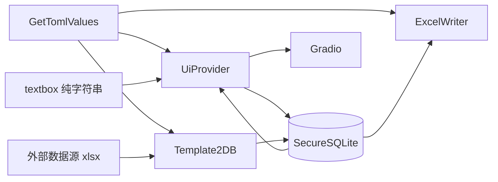

# 数据表格转换核心 — 技术规格

> **唯一权威蓝本（不得改写）**：[`docs/data_flow_design.md`](../../docs/data_flow_design.md)  
> 本文 API 展开须与蓝本一致；冲突时以蓝本为准。

## 1. 模块与依赖

```
app/services/core_toml.py      GetTomlValues, TomlDefault
app/services/core_registry.py  TEMPLATES_DIR
app/services/core_store.py     SecureSQLite, UiProvider
app/services/core_transform.py Template2DB, ExcelWriter
```

| 模块 | 允许 import | 禁止 import |
|------|-------------|-------------|
| `core_store` | `core_toml`, `core_registry`, 标准库, `sqlite3` | `core_transform`, openpyxl, 非 core_* 业务服务 |
| `core_transform` | `core_toml`, `core_registry`, 标准库, `openpyxl` | `core_store`, 非 core_* 业务服务 |

## 2. TOML 字段契约

与 [`docs/toml_config_design.md`](../../docs/toml_config_design.md) 一致。

### 2.1 路径 A — UI textbox（`core_store`）

| 键 | 语义 |
|----|------|
| `determiner` | 拆分 UI 纯字符串的分隔符，如 `"\t"` |
| `index` | 拆分结果中的段序（0-based）；`-1` 表示不参与 textbox 拆分 |
| `Input_label` | Gradio 列标题 / 模板列名 |
| `field` | 标准 DB 键名；`None`/`""` 不入标准结构 |
| `id` | `true` 时段值为主键 |

```python
# determiner = "\t", 输入 "8129\tClark Kent\t..."
# index=0 → ID#, index=1 → Name
parts = raw.split(determiner)  # 单字符或多字符由 TOML 字面量决定
```

### 2.2 路径 B — 外部数据源（`Template2DB`）

| 键 | 语义 |
|----|------|
| `source_file` | `[[sources]]` 中的键名，如 `source1` |
| `source_sheet` | 数据源工作表，如 `sheet1` |
| `Input_label` | 数据源表列标题 |
| `field` | 标准 DB 列名 |
| `regex` | 对单元格值二次提取 |
| `id` | `true` 时该列为查行 ID 列 |

`resolve_source_path(sources, key)`：在 `cfg.sources` 列表中查找 `key` 对应路径；空字符串视为未配置。

### 2.3 Excel 与区域（`ExcelWriter`）

| 键 | 语义 |
|----|------|
| `worksheet` | Input_sheet 名 |
| `sections[].input_area` | 区域范围，如 `A2:G2` |
| `sections[].move_to` | `down` / `up` / `left` / `right` |
| `sections[].offset` | 偏移行数或列数 |

写回列定位：**表头行 `Input_label` 匹配**，不使用 `index` 作列号。

## 3. 标准记录

```python
Record = dict[str, Any]
# 示例
{"id": 8129, "ID": 8129, "name": "Clark Kent", "issues": "..."}
```

- 主键：`id=true` 字段值，或 `uuid.uuid4().int >> 64`
- 入库前 ID 规范化：str / float → int
- 持久化：`json.dumps(record, ensure_ascii=False)`

## 4. `core_store.py` API

### 4.1 模块级

```python
CORE_DB_SUFFIX = ".mydatax"

def default_db_path(template_id: str) -> Path:
    """TEMPLATES_DIR / template_id / data_store.mydatax"""
```

### 4.2 `SecureSQLite`

```python
class SecureSQLite:
    def __init__(self, db_path: Path) -> None: ...
    def ensure_table(self) -> None: ...
    def insert_or_update(self, record: dict[str, Any]) -> None: ...
    def query_by_id(self, rid: int) -> dict[str, Any] | None: ...
    def query_all(self) -> list[dict[str, Any]]: ...
    def close(self) -> None: ...
```

表结构：

```sql
CREATE TABLE IF NOT EXISTS records (
    id INTEGER PRIMARY KEY,
    data TEXT NOT NULL
);
```

### 4.3 `UiProvider`

```python
class UiProvider:
    def __init__(self, cfg: GetTomlValues, db: SecureSQLite) -> None: ...

    def get_labels(self) -> list[str]:
        """[rule.Input_label for rule in cfg.field_rules]"""

    def get_data(self) -> list[dict[str, Any]]:
        """db.query_all()，仅来自 DB"""

    def split_by_determiner(self, raw: str) -> list[str]: ...

    def record_from_textbox(self, raw: str) -> dict[str, Any]:
        """determiner 拆分 + index>=0 的 rules 取段 → 标准 record"""
```

## 5. `core_transform.py` API

### 5.1 `Template2DB`

```python
class Template2DB:
    def __init__(self, cfg: GetTomlValues) -> None: ...

    def resolve_source_path(self, source_key: str) -> Path | None: ...

    def fetch_row_by_id(self, id_value: Any, source_paths: dict[str, Path]) -> dict[str, Any]:
        """
        遍历 field_rules：
        - 按 source_file/source_sheet 打开表
        - id=true 的 rule 定位行
        - Input_label 取列值
        - apply_regex
        - 写入 record[field]
        """

    def apply_regex(self, value: Any, pattern: str | None) -> Any:
        """有捕获组取首个；否则整段匹配；无匹配保留原值"""

    def generate_auto_id(self) -> int: ...
```

本阶段数据源读取以**本地 xlsx** 为主；Google Sheet 路径由上层写入 `sources` 后导出为本地文件再调用，或后续扩展。

### 5.2 `ExcelWriter`

```python
class ExcelWriter:
    def __init__(self, cfg: GetTomlValues) -> None: ...

    def _parse_area_range(self, area_str: str) -> tuple[int, int, int, int]: ...
    def _calculate_next_area(self, input_area: str, move_to: str, offset: int) -> str: ...

    def detect_areas(self, excel_path: Path) -> list[dict[str, Any]]:
        """
        返回 [{"index": 1, "area": "A2:G2", ...}, ...]
        停止：模式不一致 / 全空 / 越界
        """

    def read_area_rows(self, excel_path: Path, area: str) -> list[dict[str, Any]]:
        """Input_label → value，按区域数据行"""

    def write_back(
        self,
        excel_path: Path,
        output_path: Path,
        records: list[dict[str, Any]],
        areas: list[str] | None = None,
    ) -> None:
        """按 Input_label 对表头写值；只写纯值"""

    def get_print_areas(self, excel_path: Path) -> dict[str, str | None]:
        """openpyxl ws.print_area；无则 None"""
```

### 5.3 命令行入口

```python
if __name__ == "__main__":
    # argparse: template_id, excel_path, [--textbox RAW] [--source-id ID]
    # 打印三段：读取 / DB / Gradio labels+data
```

## 6. 端到端数据流



## 7. 错误处理

| 场景 | 行为 |
|------|------|
| TOML 加载失败 | 上层处理；本模块不启动 |
| `index` 越界（拆分段不足） | `ValueError`，说明段数与 rules 不匹配 |
| source 路径为空 | `fetch_row_by_id` 跳过或 `ValueError` |
| ID 未找到 | 返回 `None` 或空 record，由调用方提示 |
| 写回列无对应 `Input_label` | 跳过该字段，记录 warning 日志 |
