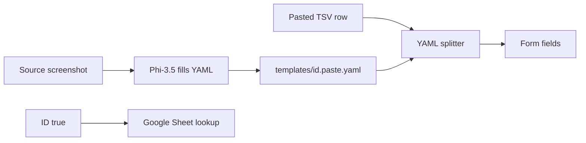

# Paste-split YAML & Phi-3.5 implementation plan

## Goal

* YAML in **spec.md §4** fully defines TSV row → Ginger (and other) form fields.
* Phi-3.5 Vision (**vLLM** in docs) fills that YAML from screenshots in **Paste mapping**.
* **Replace** legacy `paste_parse_config` / `paste_mapping_infer` / old vision column-mapping output.

## Data flow

## Scope

| Module | Change |
|--------|--------|
| `paste_parse_settings.py` | Screenshot/text → Phi-3.5 YAML; edit; save |
| `paste_parse_config.py` | New loader + splitter (`determiner` / `index` / `regex` / `filed`) |
| `phi35_vision_paste_infer.py` | English prompt → §4 YAML; 0-based index |
| `template_form.py` | Source paste + Parse & fill |
| `paste_mapping_infer.py` | Remove or optional fallback only |

**Out of scope**: change xlsx template columns; redesign Data source tab.

## YAML keys (match sample)

| Key | Meaning |
|-----|---------|
| `determiner` | `"tab"` or `/` `,` space |
| `order` | Optional source header list |
| `<template field>` | Form label |
| `filed` | Source header; `?` if unknown |
| `index` | **0-based** source column |
| `regex` | Optional extract from cell string |
| `ID` | `true` → sheet lookup key |

## Phi-3.5 responsibilities

* **Does**: screenshot → fill `filed`, `index`, `regex`, `ID` per template field.
* **Does not**: split a paste row into form values (local parser does that).
* **Path**: `app/vllm/phi-3.5-vision-instruct-int4-ov`.

## User flow

1. **Paste mapping**: download model (first time) → paste screenshot → Phi-3.5 YAML → edit → save.
2. **Data entry**: paste TSV → **Parse & fill**.
3. `ID: true` + data source configured → auto Sheet lookup (unchanged).

## Steps

1. New YAML validate + split engine (0-based, regex).
2. English Phi-3.5 prompt + validation (`?` for unknown).
3. UI copy: paste mapping serves data entry.
4. Remove old `fields/target` parser; migrate tests to TSV fixture.
5. E2E: `tests/test_image.png` + fixture TSV line.

## Acceptance

* Saved YAML matches §4; index 0-based.
* Fixture TSV splits match spec table.
* Phi-3.5 screenshot YAML + light edit passes split test.
* `ID: true` still triggers lookup.

## Browser check (Phase 4.3)

Manual verification on **Ginger Lots** template (2026-06-09):

| Tab | Check |
|-----|-------|
| Paste mapping | Model download panel, paste screenshot, infer, YAML editor, save |
| Data entry | Source paste area, Parse & fill disabled until YAML saved |
| Data source | Google Sheet config unchanged; `ID: true` in paste YAML triggers auto lookup |

---
