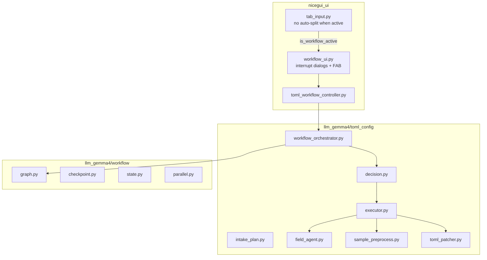

# Gemma4 Dynamic TOML Workflow — Technical Plan

> **Spec-kit:** templates not in repo; this file is the implementation plan  
> **Specification:** [specify.md](specify.md)  
> **Tasks:** [tasks.md](tasks.md)  
> **Live status:** [STATUS.md](STATUS.md) — phases A–D largely implemented on `feature-gemma-toml-3`; orchestration in `llm_gemma4/toml_config/`, not `wizard/`

---

## 1. Architecture



### Layers

| Layer | Package | Responsibility |
|-------|---------|----------------|
| UI | `nicegui_ui/components/` | Interrupt-driven chrome; preserve Input tab guard |
| Orchestration | `llm_gemma4/toml_config/workflow_orchestrator.py` | `tick()` loop: decide → execute → checkpoint |
| Decision | `llm_gemma4/toml_config/decision.py` | Gemma `next_action` JSON |
| Execution | `llm_gemma4/toml_config/executor.py` | Action catalog; calls field agents / patcher |
| Runtime | `llm_gemma4/workflow/` | Graph, interrupt, resume, parallel map_send |
| Domain | `llm_gemma4/toml_config/*` | TOML generation, preprocess, prompts |

---

## 2. Package layout (final)

```
llm_gemma4/
  workflow/
    __init__.py
    state.py           # WorkflowState, FieldState, Command, InterruptPayload
    graph.py           # WorkflowGraph, CompiledWorkflow
    checkpoint.py      # MemoryCheckpoint (+ optional SqliteCheckpoint)
    router.py
    parallel.py        # map_send(labels, cap=2)

  toml_config/
    __init__.py
    workflow_orchestrator.py
    decision.py
    parse_decision_json.py
    executor.py
    intake_plan.py
    design_doc.py
    field_agent.py     # from wizard/
    sample_preprocess.py
    prompts.py
    parse_field_json.py
    context.py
    template_labels.py
    toml_patcher.py

  wizard/              # DELETE in Phase D — must not exist at release
```

**NiceGUI renames (optional but recommended):**

| Current | New | Notes |
|---------|-----|-------|
| `toml_wizard.py` | `toml_workflow_controller.py` | `WorkflowController` class |
| `wizard_ui.py` | `workflow_ui.py` | `is_workflow_active()`, interrupt handlers |
| `app.storage.user["wizard_active"]` | `workflow_active` | migrate key or alias both during transition |

---

## 3. Migration inventory (`wizard/` → delete)

| Source (`llm_gemma4/wizard/`) | Destination | Action |
|--------------------------------|-------------|--------|
| `state.py` | `workflow/state.py` | Extend → `WorkflowState` |
| `orchestrator.py` | `executor.py` + `workflow_orchestrator.py` | Split; delete advance() |
| `field_agent.py` | `toml_config/field_agent.py` | Copy; fix imports |
| `sample_preprocess.py` | `toml_config/sample_preprocess.py` | Copy |
| `sample_analysis.py` | merge into `sample_preprocess.py` | Merge helpers |
| `toml_patcher.py` | `toml_config/toml_patcher.py` | Copy |
| `prompts.py` | `toml_config/prompts.py` | Copy |
| `parse_field_json.py` | `toml_config/parse_field_json.py` | Copy |
| `context.py` | `toml_config/context.py` | Copy |
| `template_labels.py` | `toml_config/template_labels.py` | Copy |
| `trial_run.py` | — | Drop (trial cancelled) or port to `test/` only |

### Code **outside** `wizard/` to preserve (not deleted)

| File | Behavior to keep |
|------|------------------|
| [`nicegui_ui/pages/tab_input.py`](../../nicegui_ui/pages/tab_input.py) L726–728 | `if is_wizard_active(): return` before `record_from_textbox` |
| [`nicegui_ui/components/wizard_ui.py`](../../nicegui_ui/components/wizard_ui.py) | Layout dialog (multi `input_area`, multi `move_to`), db_id dialog, FAB, chat log — refactor to interrupt kinds |
| [`nicegui_ui/pages/main.py`](../../nicegui_ui/pages/main.py) | Shell chrome registration, stop on template switch |
| [`nicegui_ui/pages/tab_toml.py`](../../nicegui_ui/pages/tab_toml.py) | Start workflow entry point |
| [`app/core_split.py`](../../app/core_split.py) | Shared determiner split |

---

## 4. Executor action catalog

| `action_id` | Type | Preconditions | Side effects |
|-------------|------|---------------|--------------|
| `record_sources` | ask/compute | template selected | `data_sources`, persist TOML |
| `capture_layout` | ask | sources recorded | `input_area`, `move_to`, `offset`, rebuild fields |
| `capture_sample` | ask | layout done | `ghost_text_sample`, `user_draft` (single interrupt) |
| `preprocess_sample` | compute | ghost captured | `indexed_segments`, `determiner` |
| `plan_ghost_tasks` | compute | preprocess done | `planned_labels` via `wizard_main` |
| `match_ghost_fields` | compute | plan done | parallel field agents, update `index` |
| `match_sheet_columns` | compute | ghost match done; sheet optional | skip if no Google source |
| `infer_regex` | compute | fields with `needs_regex` | regex per field |
| `finalize_toml` | ask/finalize | all required progress done | `db_id`, persist, `finished=True` |

---

## 5. IntakePlan keys

```python
# Built by intake_plan.build_intake_plan(state) -> list[IntakeItem]
# Each item: key, status, canonical_interrupt_kind, satisfied_by_state_field

INTAKE_KEYS = [
    "data_sources",
    "input_section",      # input_area + move_to + offset
    "ghost_sample",
    "field_drafts",       # same interrupt as ghost_sample
    "ghost_preprocess",   # compute-only; not ask_user
    "field_match",        # per-label; satisfied when all labels resolved
    "sheet_match",        # skip if no sheet
    "regex_infer",        # skip if none needs_regex
    "db_id",
]
```

Decision layer receives `IntakePlan` + `already_captured`; must not emit `ask_user` for satisfied keys.

---

## 6. Lite runtime API

```python
# llm_gemma4/workflow/graph.py

class WorkflowInterrupt(Exception):
    payload: InterruptPayload

class WorkflowGraph:
    def add_node(self, name: str, fn: NodeFn) -> None: ...
    def add_edge(self, src: str, dst: str) -> None: ...
    def add_conditional_edges(self, src: str, router: RouterFn, path_map: dict) -> None: ...
    def compile(self, checkpointer: CheckpointStore) -> CompiledWorkflow: ...

class CompiledWorkflow:
    def invoke(self, state: WorkflowState, thread_id: str) -> WorkflowState: ...
    def resume(self, thread_id: str, value: Any) -> WorkflowState: ...
    def is_interrupted(self, thread_id: str) -> bool: ...
```

**Interrupt rule:** one interrupt per node invocation; validation loops via state flag + conditional edge.

---

## 7. Main loop (`workflow_orchestrator.tick`)

```python
def tick(self, user_input: dict | None = None) -> WorkflowState:
    if self._compiled.is_interrupted(self._thread_id):
        return self._compiled.resume(self._thread_id, user_input)
    plan = build_intake_plan(self.state)
    decision = decide(self.state, user_input, plan)  # thinking=False
    result = execute(decision, self.state, self._backend)
    self.state = merge(self.state, result.state_patch)
    self.history.append({"decision": decision, "result": result})
    if result.interrupt:
        raise WorkflowInterrupt(result.interrupt)  # caught by controller → UI
    if decision.next_action == "finalize" or self.state.finished:
        return self.state
    # yield to UI between long compute phases when auto_chain=False
    return self.state
```

Phase A: `decide()` returns hard-coded sequence (no Gemma routing).  
Phase B: Gemma-driven `decide()`.

---

## 8. Phased delivery

### Phase A — Runtime + executor parity (no Gemma routing)

- [ ] Create `llm_gemma4/workflow/*`
- [ ] Create `llm_gemma4/toml_config/*` by copying wizard modules
- [ ] Implement `executor.py` with action handlers lifted from `orchestrator.py`
- [ ] `workflow_orchestrator.tick()` with **hard-coded** action sequence
- [ ] Refactor `wizard_ui` → interrupt-driven; keep layout/db_id dialogs
- [ ] Verify: v8.3 acceptance scenarios (layout, sample, match, save)
- [ ] **Do not delete `wizard/` yet** — run parallel imports behind feature flag if needed

### Phase B — Decision layer + IntakePlan

- [ ] `intake_plan.py`, `design_doc.py`, `decision.py`, `parse_decision_json.py`
- [ ] Replace hard-coded sequence with `decide → execute`
- [ ] Tests: no duplicate `ask_user` for same IntakePlan key
- [ ] Tests: only `field_*_pass2` uses `thinking=True`

### Phase C — Dynamic UX

- [ ] Remove `ui_step` as driver; progress from `state.progress` / `history`
- [ ] Rename `wizard_active` → `workflow_active` (with backward-compat alias)
- [ ] Sidebar log from `history` instead of `[Step x/8]` hard tags

### Phase D — Delete `wizard/` + docs cutover

- [ ] Grep repo: zero imports from `llm_gemma4.wizard`
- [ ] Delete `llm_gemma4/wizard/` directory
- [ ] Add `docs/gemma4_dynamic_workflow.md`; delete `docs/gemma4_e4b_workflow.md`
- [ ] Update `tab_input.py` import: `is_workflow_active` from `workflow_ui`

---

## 9. Risks

| Risk | Mitigation |
|------|------------|
| Broken imports after delete | Phase D gated on grep-clean + manual wizard E2E |
| Duplicate user prompts | IntakePlan + executor guards + pytest |
| KV cache blow-up | Enforce thinking only on pass2; audit with grep `thinking=True` |
| NiceGUI interrupt lost on refresh | Checkpoint in `app.storage.user` + `thread_id` |

---

## 10. Dependencies

- Existing: `litert-lm`, NiceGUI, `tomlkit`, `app/core_split.py`
- **Not added:** `langgraph`, `langchain`
