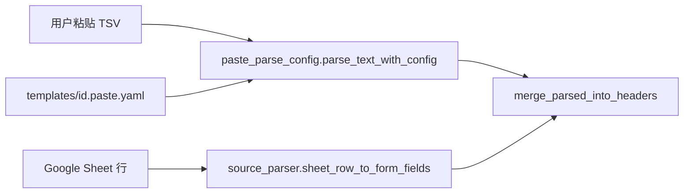

# 项目清理技术计划（plan.md）

## 1. 目标

依据审计任务 a7d71f75 与用户指令，将仓库收敛为：

* 仅以 `requirements.txt` + `streamlit run` 驱动的 Streamlit 应用；
* 无 pytest、无 `tests/`、无过时注册表与双语弃用 Speckit；
* `app/` 内无已裁决的死代码；
* 文档（README、CODEGRAPH）反映当前架构。

## 2. 架构上下文（清理后）

```
excel-template-viz/
├── app/                    # 唯一应用代码
├── templates/              # xlsx + sidecar + *.paste.yaml
├── plans/                  # Speckit（英文档案 + 本清理计划）
├── scripts/                # debug_vision_paste.py 等
├── requirements.txt        # 唯一依赖清单
├── streamlit_app.py
└── README.md / QUICKSTART.md
```

**移除后不再存在**：`tests/`、`pyproject.toml`、`config/templates.json`、6× `*_zh.md`、重复 plans fixture。

## 3. 数据流更正（供 CODEGRAPH 刷新）

当前粘贴路径（审计已确认 legacy 路径未走生产）：



旧文档错误：制表符粘贴 → `parse_source_text`（已废弃）。

## 4. 实施阶段

| 阶段 | 内容 | 风险 |
|------|------|------|
| **0. 裁决确认** | 确认 §3 默认选项（list_template、legacy parser、pyproject、CODEGRAPH） | 低 |
| **1. pytest 拆除** | 删 `tests/`、依赖与配置 | 低（用户明确要求） |
| **2. 配置与依赖** | `config/templates.json`、`torchvision`、`pyproject.toml` | 低 |
| **3. 文档与 fixture** | `*_zh.md`、重复 YAML、implementation_context | 低 |
| **4. 应用死代码** | §2.5 / §3 符号删除 | 中（需 grep 确认无引用） |
| **5. 文档刷新** | README、CODEGRAPH、`.gitignore` | 低 |
| **6. 验证** | 手动 Streamlit 冒烟 + grep 扫描 | — |

## 5. 依赖关系

* 阶段 4（死代码）**必须在**阶段 1（删 tests）**之后**，否则无法靠测试发现误删；实施时用 `grep` 验证引用。
* `list_template_data_sources` 与 legacy `source_parser` 粘贴函数删除依赖阶段 1 完成。
* CODEGRAPH 刷新应在阶段 4 完成后进行，避免再次描述已删 API。

## 6. 手动验证清单（替代 pytest）

1. `streamlit run streamlit_app.py` 启动无 import 错误。
2. 侧边栏模板列表来自 `templates/*.xlsx`。
3. **数据录入**：粘贴 TSV → Parse & fill（需已保存 `.paste.yaml`）。
4. **数据源**：Sheet 连接、ID 查表填表。
5. **粘贴映射**：Phi-3.5 推理（可选，慢路径）。
6. 导出 xlsx 与打印区域功能正常。

## 7. 不在范围内

* 新增 CI、linter、vulture/ruff。
* 将 `requirements.txt` 迁移到 `pyproject.toml` 统一管理（与「删除 pyproject」决策一致）。
* 重写已完成 Speckit 计划的英文正文。
* 删除 `plans/excel_template_viz/` 或 `plans/template_auto_discovery/` 整目录。

## 8. README 更新

在「文档 / Docs」增加本计划链接：

* `plans/project_cleanup/` — 死代码与 pytest 清理（中文 Speckit）

删除「测试 / Tests」章节；Speckit 弃用说明保持，可补充「清理计划已移除 `*_zh.md`」。
