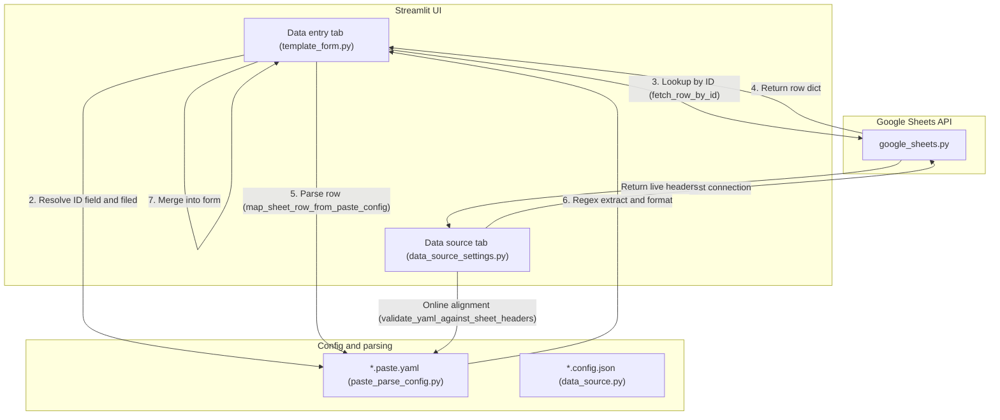

# YAML-Driven Google Sheet Lookup — Technical Plan (plan.md)

## 1. Goals

This plan upgrades Google Sheet ID lookup and auto-fill in the **Data entry** tab so it is 100% driven by `*.paste.yaml`.

* **Unified mapping config**: Stop using sidecar JSON `column_mappings` as the primary Sheet lookup mapping. Use `.paste.yaml` `filed` and `regex` rules to parse fetched rows into form fields.
* **Live header validation**: After a successful **Test connection** in the **Data source** tab, fetch live Sheet headers and compare them to `.paste.yaml` `filed` values with clear alignment feedback.
* **Full Ginger Lots support**: Complete `templates/Ginger_Lots.paste.yaml` for all fields and ship a default `Ginger_Lots.config.json` sidecar so PO, supplier, container, seal, lot, truck line, product description, and receiving date work end-to-end via auto lookup.
* **Backward compatibility**: If a template has no `.paste.yaml`, safely fall back to the existing sidecar JSON data-source mapping.

## 2. Architecture and Data Flow

## 3. Implementation Phases

| Phase | Scope | Core files | Risk |
|-------|-------|------------|------|
| **1. Mapping engine** | Implement `id_column_from_config` and related parse/map helpers | `app/services/paste_parse_config.py` | Low |
| **2. Data entry wiring** | Prefer YAML-driven mapping in `_apply_sheet_lookup` | `app/components/template_form.py` | Medium (fallback compatibility) |
| **3. Online validation UI** | Header validation UI; auto-fill ID column after test | `app/components/data_source_settings.py` | Low |
| **4. Template config** | Complete Ginger Lots files; test PO `10073` lookup | `templates/Ginger_Lots.paste.yaml`, `templates/Ginger_Lots.config.json` | Low |
| **5. Manual E2E** | Smoke multiple scenarios; verify alignment and errors | — | — |

## 4. Dependencies

* **Phase 2** Sheet parsing depends on **Phase 1**.
* **Phase 3** validation UI depends on **Phase 1** `validate_yaml_against_sheet_headers`.
* **Phase 5** manual E2E depends on **Phase 4** Ginger Lots config (Sheet connection + full YAML).

## 5. Manual Verification Checklist

1. **Test connection and header validation**
   * Open **Data source**, enter Google Sheet URL, click **Test connection**.
   * Confirm success and table preview.
   * **Validation feedback**: Page shows online match table for `.paste.yaml` vs current Sheet headers (matched vs missing).
   * **Dropdown sync**: ID column dropdown defaults to the YAML ID rule’s `filed` (e.g. `PO`).

2. **Data entry auto lookup**
   * Switch to **Data entry**.
   * Select a row and enter `10073` in `P.O. No.`.
   * **Auto lookup**: After ~2 seconds, Sheet query runs, YAML parsing updates the current row.
   * **Full fill**: Truck line, container, seal, receiving date, product description, supplier, lot, etc. are filled correctly.
   * **Date parsing**: `Receiving Date`, `MM`, `DD` regex rules extract subfields correctly.

3. **Backward compatibility**
   * Hide/rename a template’s `.paste.yaml` so it is not loaded.
   * Run **Test connection** and ID auto lookup.
   * Confirm fallback to sidecar `column_mappings` (PO, Container, Receiving Date still fill).

4. **Errors and edge cases**
   * Enter a PO that does not exist in the Sheet.
   * Confirm warning: “No record found for PO='...'”, and existing manual values on the row are not cleared.

## 6. Out of Scope

* Physical changes to Excel template columns in `templates/*.xlsx`.
* Changes to Google Sheets auth or underlying `gspread` read logic.
* Manually completing YAML for every non–Ginger Lots template.
